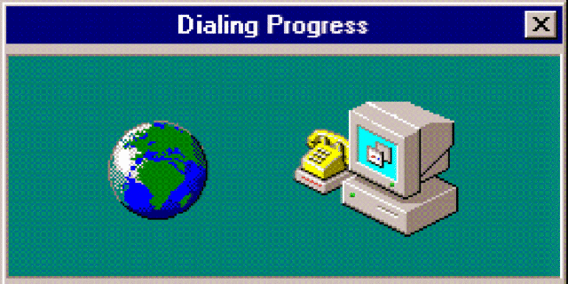
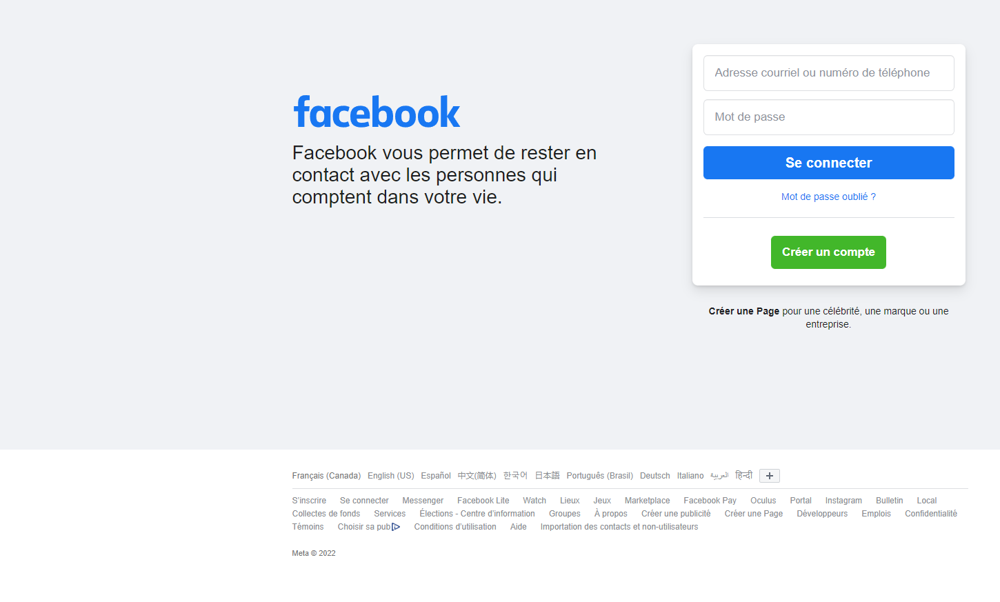

# Bienvenue au cours de Web 1

Dans le cours de web 1, nous explorons la création de pages web côté client. Le
cours se limite au design des pages et à
des animations simples. Le prochain cours se concentra sur l'utilisation du
JavaScript côté client. Ceci permet l'ajout
de logique et de « dynamisme ».


## Au menu du cours

* [Histoire du web](#histoire-du-web)
* [Comment fonctionne le Web ?](#comment-fonctionne-le-web-)
* [Différence entre le HTML et le CSS](#différence-entre-le-html-et-le-css)
* [Navigateurs et éditeurs ](#dans-ce-cours)
* [Visual Studio Code](#visual-studio-code)

## Histoire du web

Internet est une évolution du réseau ARPANET, soit « Advanced Research Projects
Agency Network ». C'est un réseau de recherche créé dans les années 1960 par des
universités
américaines et commandités par les agences militaires américaines. La transition
de l'ARPANET vers un réseau grand
public et commercial a débuté dans les années 1980, pour devenir Internet dans
les années 1990.


L'invention du World Wide Web remonte à **1989** par le chercheur Britannique *
*Tim Berners-Lee**. Chercheur au **Centre
Européen de la Recherche Nucléaire** (CERN), Bernes-Lee souhaitait créer un
réseau d'échange d'information instantané
entre les universités et les chercheurs. En effet, le CERN n'est pas un simple
laboratoire. Le CERN regroupe plus de 17
000 personnes en recherche dans plus de 100 pays. C'est aussi le Grand
collisionneur de hadrons (LHC) soit l'immense
accélérateur de particules de 27 km de circonférence à la frontière
franco-suisse.


Le projet du web repose en partie sur le système Xanadu élaborer par
**Théordore Holm Nelson** (Ted Nelson) en 1960 alors étudiant en sociologie à
l'Université Harvard. Ce dernier souhaitait
créer un système d'information au bout des doigts. Son projet repose une machine
capable de stocker des données et de
les mettre à disposition partout dans le monde. Durant ce projet, Nelson créa le
concept d'**hypertexte**.

L'hypertexte est un format de document regroupant plusieurs éléments comme des
images, des sons, des données, etc. Tous ces
éléments sont accessibles par un lien. Ce lien peut être interne à la machine (
local) ou externe. En effet, le WWW et
l'hypertexte ne sont qu'un système d'échange d'information et des structures de
données. Le web **ne permet pas**
l'échange d'information. Il est l'information.

La tâche de la transmission d'informations est dédiée à un réseau d'échange en
temps réel des informations soit l'**internet**. En terme technique, l'internet
est un réseau à **commutation de paquets**
décentralisé. Chaque information envoyée le sera sous la forme d'un paquet :
*paquet = en-tête d'information + charge
utile (donnée) + pied de fermeture*

Ces paquets sont utilisés pour réduire la corruption et facilité le transfère.
Depuis, l'internet repose sur plusieurs
protocoles comme le FTP (*File Transfert Protocol*). Néanmoins, Berners-Lee
inventa le
**HTTP** (*Hypertext Transfer Protocol*) ainsi que les adresses web basées sur
les serveurs DNS.


De plus, le WWW repose sur le partage d'information. Il était donc nécessaire de
créer un langage permettant de
structurer les pages du web. C'est ainsi qu'est né le **HyperText Markup
Language** (HTML).

Ce langage est inspiré du **Standard Generalized Markup Language**
(SGML). Ce langage permettait de décrire des documents. Inspiré du
**Generalized Markup Language**, le SGML a été normalisé par les communautés
européennes (ancêtre de l'Union européenne).

Après toutes ses innovations, le CERN libéra le code source du Web en 1993.
Cette libération permit la multiplication des serveurs web ainsi que sa
démocratisation au sein du public.

À la fin de 1994, le Web comportait 10 000 serveurs (2 000 serveurs à usage
commercial) et 10 millions d'utilisateurs.
Cette démocratisation apporta néanmoins de nombreux défis tels que technique (
capacité de transfert entre autres) et de
sécurité (protection des informations sensibles par exemple).

Bien que le HTML répond bien au besoin de *structure* des documents web, les
auteurs de page Web n'avaient pas la
possibilité de **décrire son visuel**. Ainsi, dès 1994, **Netscape Navigator**,
tout nouveau navigateur sur le marché,
introduit les premiers éléments de présentation directement dans le code HTML.
Par la suite, plusieurs projets ont été
proposés :

- *Stylesheet proposal* de Pei Wei
- *Stylesheets for HTML* de Robert Raisch (O'Reilly)
- *Cascading HTML Style Sheets* (CHSS) d'Håkon Wium Lie
- *JavaScript-Based Style Sheets* (JSSS) par Netscape Navigator

L'utilisation du CSS (***Cascading Style Sheets*** ou **feuilles de style en
cascade**) a été retenu par Dave Raggett
alors le principal éditeur du projet de spécification du HTML 3.0 au W3C. Ce
dernier souhait implanter un langage de
description pur et indépendant du HTML, car le HTML devait, selon lui, être un
langage purement structurel.

De plus, le second avantage du CSS repose le principe de *cascade*. Ce principe
traduit la possibilité, pour une page
web, d'avoir un style qui hérite de plusieurs feuilles de style différentes.

En 1995, le World Wide Web Consortium (W3C), l'organisme chargé de la
normalisation du Web, est opérationnel et crée le
groupe de travail sur le CSS. Durant la même année, le W3C tient, à Paris, le
*W3C style sheet workshop*. Cette
conférence opta pour des feuilles de style simple comme le CSS et Microsoft
annonça qu'il supporte le CSS dans son
navigateur*Internet Explorer* dans les futures versions du logiciel.


Après cette annonce, la première spécification du CSS est présentée le 17
décembre 1996. Cette dernière contient alors
50 propriétés. Néanmoins, les mises à jour des spécifications sont lentes et
difficiles. En effet, chaque niveau du CSS
doit alors être compatible et intégrer la précédente. Donc, CSS 3 intègre CSS
2.1 et CSS 1.

Le deuxième niveau CSS2 est publié en mai 1998, alors que le troisième niveau
CSS3 est publié par module à partir de
2011 alors que son développement commença en 1999 à la suite de CSS2. En 2017,
plusieurs modules comme *Transforms* et
*Transitions* n'ont toujours pas été publiés. Cette lenteur conduit alors à la
guerre des navigateurs et elle explique
pourquoi certaines pages ne s'affichent pas correctement sur différent
navigateur et parfois différente version d'un
même navigateur.

Plusieurs dialectes de CSS comme SASS et SCSS sont inventés pour aider le
développement en CSS. Malheureusement, ces dialectes ne sont pas compris par les
navigateurs, car ils ne sont pas dans le standard CSS. Dans le cadre du cours,
ces dialectes ne seront pas vus, car ils demandent d'utiliser des
pré-processeurs.


## Comment accède-t-on au Web aujourd’hui ?

Le Web a été démocratisé. Il est facilement accessible. Certains le décrivent
comme un service essentiel. Les
technologies se sont développées. Il n'existe plus de limite. Alors qu'en 2000,
l'internet haute vitesse était à ses
balbutiements, il n'était pas imaginable de pouvoir écouter un film dans une
qualité proche du cinéma dans son salon.

Les navigateurs Web se sont plus l'unique moyen d'accédé au WWW. Des
applications comme Facebook ou Netflix utilisent
les protocoles de communication pour réaliser différentes activités. Il existe
aussi des systèmes d'exploitation
reposant sur le Web (WebOS, ChromeOS).

De plus, les vitesses de transfert augmentent de plus en plus (réseau en
fibre-optique, LTE, 5G) tout en dominant des
inconvénients comme la latence et la perte de donnée. Imaginez, nous sommes
passés d'une offre de connexion Internet à 56 kbit/s au début des années 2000 à
1 Gbit/s en 2022.



### Statistiques de la population ayant accès à Internet

| Année   | 2002 | 2003 | 2004 | 2005 | 2006 | 2007 | 2008 | 2009 | 2010 | 2011 | 2012 | ... | 2022 |
|---------|-------|-------|-------|-------|-------|-------|-------|-------|-------|-------|-------|-----|-------| 
| %       | 61,59 | 64,20 | 65,96 | 71,66 | 72,40 | 73,20 | 76,70 | 80,30 | 80,30 | 83,00 | 86,77 | ... | 97,00 |

## Comment fonctionne le Web ?

Grâce au protocole HTTP, le client (nous) demande à un serveur des informations
concernant une ressource (page Web).
Le serveur nous renvoie cette information par parquet. Le client prend alors ses
informations et ils les interprètent
pour nous les afficher.


## Différence entre le HTML et le CSS

Le HTML permet de spécifier la **structure** de l'information. Dans un fichier
HTML, nous décrivons le contenu et son
emplacement (dans l'entête, dans tel ou tel conteneur, dans le pied de page). Il
n'y a pas de visuel.

Le CSS permet de spécifier la **vue** de l'information. Dans un fichier CSS,
nous indiquons la couleur au texte, la
taille des images, l'espace entre les conteneurs. Sans le CSS, les pages ont
toutes la même vue de base. Soit une
lecture simple et directe par le navigateur des balises HTML.

### Voici une page Facebook avec ou sans CSS. C'est exactement le même HTML.




## Qu'est-ce qu'un moteur de rendu ?

Dans chaque navigateur, vous retrouvez un moteur de rendu. Ce dernier est
responsable d'interpréter les balises HTML
afin de savoir quoi afficher et les styles CSS pour déterminer comment afficher
les éléments.

Si un moteur de rendu ne sait pas où trouver une feuille de style (CSS), il
utilisera un style de base implémenté
directement dans son code.

<div style="page-break-after: always;"></div>

## Dans ce cours

En 420-1W1-DM, nous verrons comment mettre en page nos éléments (texte, tableau,
images, vidéo, etc.) grâce au HTML. Par
après, nous verrons comment ajouter du style et, ainsi, rendre nos pages
attrayantes.

## Qu'est-ce que nous allons utiliser dans ce cours ?

Concernant le serveur, nous utiliserons nos ordinateurs. En effet, les pages
HTML et CSS ne nécessitent pas
d'interpréteur autre que le moteur de rendu d'un navigateur. Ainsi, il suffit
d'ouvrir une page HTML
(`mapage.html` par exemple) dans un navigateur. Soit en passant par
*Fichier/Ouvrir un fichier* dans le menu du navigateur ou assignant les fichiers
HTML à un navigateur.

## Quel navigateur allons-nous utiliser ?

Nous utiliserons au moins 2 navigateurs. Un navigateur doit utiliser le moteur
de rendu Gecko (Mozilla Firefox). Pour ce
dernier, je vous recommande
[Firefox Developer Edition](https://www.mozilla.org/fr/firefox/developer/). Dans
cette version, les outils de
développement sont déjà activés. Ceci facilitera le développement des pages Web.

Le second navigateur devra utiliser le moteur de rendu Blink. Ce moteur est
utilisé par le projet Chromium en autre. Ce
projet open source est la base de Google Chrome ou encore la nouvelle version de
Microsoft Edge.

<div style="page-break-after: always;"></div>

## Pourquoi utiliser différents navigateurs ?

Comme le montre l'image ci-bas, les navigateurs Blink représentent près du trois
quarts des navigateurs utilisés. Il est
donc nécessaire d'ajuster nos sites aux 25% qui reste. Le Web doit être
**accessible**. Pourquoi aucun moteur de rendu ne s'est établi comme l'unique
moteur ? Pour certains, il s'agit d'une
question technologique. Pour d'autres, il s'agit simplement d'utiliser le
navigateur disponible dans son ordinateur.


[Parts de marché des navigateurs Web version interactive](https://fr.wikipedia.org/wiki/Parts_de_marché_des_navigateurs_web)

## Un éditeur pour écrire les pages

Fondamentalement, les fichiers HTML et CSS sont essentiellement des fichiers
textes. Bien évidemment, vous pouvez
utiliser un IDE spécialisé dans le développement web comme WebStorm de
JetBrains (le créateur d'IntelliJ que vous
utilisez en 1N1). Néanmoins, l'utilisation d'un IDE n'est pas nécessaire pour ce
cours.

Vous pouvez utiliser l'éditeur multiplate-forme
[Visual Studio Code](https://code.visualstudio.com/). Cet éditeur est suffisant
pour ce cours. Ou vous pouvez tout
simplement utiliser IntelliJ, que vous devez installer pour le cours
d'introduction à la programmation (1N1)
de toute façon.

## Visual Studio Code

Visual Studio Code (**VS Code**) est un éditeur de code source léger et
flexible. Il est gratuit et le code est ouvert au public.

Vous
pouvez [télécharger Visual Studio Code ici](https://code.visualstudio.com/Download)

L'avantage principal de Visual Studio Code est ses extensions. Une extension
permet d'ajouter des fonctionnalités à l'éditeur de base.

Visual Studio Code supporte sans extension le développement de page
HTML → https://code.visualstudio.com/Docs/languages/html

Le support inclus plusieurs éléments facilitant le développement HTML et CSS:

* Suggestions de balises (**IntelliSense**)
* Auto complétion des balises
* *Tooltip*
* Formatage des balises

Si vous utilisez Visual Studio Code, les extensions *HTML Essentials* et *HTML
Preview* sont recommandées pour faciliter le dévelopment de pages web.

 

Exemple d'installation de l'extension HTML Preview

Pour avoir l'éditeur en français, il faut télécharger une extension


C'est exactement de cette façon que j'édite ces notes ou les énoncés des travaux
pratiques!

<div style="page-break-after: always;"></div>

### Vérification du français

Il existe une extension de Visual Studio Code qui permet de vérifier le français
dans plusieurs types de fichier comme le HTML ou le Java.

Ajouter ces deux extensions :

- Code spell checker
- French - Code spell checker


Pour activer le dictionnaire de **Code spell checker**,
dans Visual Studio Code sélectionner la touche F1 ou cliquer sur le menu
Affichage -> Palette de commandes

Dans la boite, entrez ceci -> **Show Spell Checker Configuration Info**.

Sélectionner l'onglet Workspace ou User selon votre préférence.
Activer la ou les langues que vous voulez.


## Votre première page HTML!

Pour créer votre première page HTML, ouvrez VS Code.

Aller dans le menu **Fichier** et sélectionner **Ouvrir le dossier**


Sélectionner un dossier où vous voulez mettre votre première page HTML.

Une fois le dossier ouvert dans VS Code, créez un nouveau fichier **index.html**
dans l'explorateur de fichier avec un clique droit.


Éditez le fichier pour ajouter ceci

```html
<h1>Bonjours tout le monde!</h1>
<p>Je m'appelle XYZ</p>
```

Vous pouvez visualiser le résultat dans un navigateur ou depuis VS Code. Et
voilà votre première page HTML!

Notes écrites par Godefroy Borduas, modifiées par Denis Rinfret et Pierre-Luc
Boulanger.
