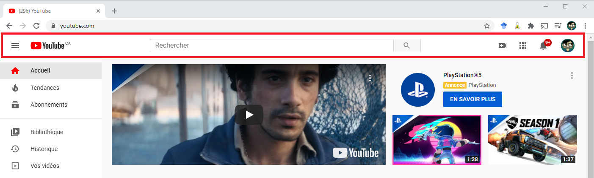

Les balises du cours précédent (révision)
-----------------------------------------

En vrac, nous avons vu :

- les commentaires : `<!-- -->`
- Les niveaux de titre :

```html
<h1>Titre très important</h1>
<h2>Titre important</h2>
<h3>Titre considérable</h3>
<h4>Titre moins important</h4>
<h5>Titre encore moins important</h5>
<h6>Titre de dernier niveau</h6>
```

- La mise en **gras** : `<strong></strong>`
- La mise en *italique* : `<em></em>`
- Le texte <mark>surligné</mark> : `<mark></mark>`
- Les listes non ordonnées : `<ul></ul>`
- Les listes ordonnées : `<ol></ol>`
    - Trois attributs des listes ordonnées : `start="number"`,
      `type="v"`, `reversed`
- Les éléments de liste `<li></li>`
- Les hyperliens : `<a href="lien"></a>`

### Les deux types de liens *relatifs* et *absolus*

**Les liens *relatifs*** établissent le chemin entre un fichier et une
ressource (une autre page, une image, etc.) à partir de sa propre proposition.

    Dossier du site web/
        |---index.html
        |---media/
        |  |---images/
        |  |  |---photo.png
        |  |  |---logo.png
        |  |---video/
        |  |  |---promo.mp4
        |---page2.html

Depuis la page `index.html`, le chemin d'accès vers la page
`page2.html` est simplement :

````
    ./page2.html
````

Le point représente la position du fichier `index.html`. Le chemin, depuis ce
même fichier, pour le fichier `logo.png`
est :

````
    ./media/images/logo.png
````

**Les liens *absolues*** représente un chemin d'accès depuis la racine d'un site
web. C'est-à-dire son nom de domaine.
Prenons l'exemple que la page `index.html` souhaite accéder à la
page `moncv.html` sur le site `exemple.com` et que
cette page se trouve dans le dossier `Parcours`, alors le chemin est :

````
    https://godefroy.ca/Parcours/moncv.html
````

Les liens vers d'autres items qu'une ressource web
--------------------------------------------------

La semaine dernière, nous avons utilisé les liens pour naviguer d'une page à
l'autre. Il ne s'agit pas du seul moyen d'utiliser les liens. Nous pouvons
avoir un lien entre les éléments (titre, paragraphe, image, etc.) au sein
d'une même page. Aujourd'hui, nous étudierons comment créer des liens vers
une section ou un élément de notre site web, des courriels, les fichiers,
les téléphones, etc. En premier lieu, nous allons nous intéressé à lier des
sections.

Vous pouvez imaginer plusieurs utilisations :

- table des matières
- notes de bas de page
- référer à une autre section (ex. *contactez-nous*)
- etc.

Néanmoins, pour y parvenir, il faut que le navigateur soit en mesure de
distinguer les différents éléments. De base, il
ne sait pas comment différencier les deux titres suivants :
`<h1>mon premier titre</h1>` et `<h1>mon deuxième titre</h1>`. Il est donc
nécessaire de les identifier. C'est-à-dire de
leur donner une valeur unique, dans la page, afin d'être en mesure de le
retrouver.

Identification des éléments
---------------------------

Pourquoi est-ce important de distinguer des éléments d'un site ? Pour la même
manière qui est importante de retrouver
facilement des employés dans une entreprise. Imaginez que vous travailler pour
Exemple Inc. Vous souhaitez retrouver
l'employé Luc. Votre recherche risque d'être difficile. Luc est un prénom assez
populaire et donc il y a plusieurs Luc.
Il serait alors utile d'avoir un identifiant unique à Luc. Disons que
l'identifiant de Luc est 1120548. Vous savez que
l'employé 1120548 est le Luc que vous recherchez. Il est donc **identifiable**.
Je peux refaire le même exercice avec
vous. Au cégep, votre identifiant est simplement votre numéro de DA. En d'autres
mots, nous identifions des personnes,
des lieux, des objets ou des éléments de page web pour être en mesure de les
retrouver facilement. Imaginez le code
suivant :

```html
<h1>Mon premier titre</h1>
<h2>Mon premier paragraphe</h2>
<p>
    Lorem ipsum dolor sit amet, consectetur adipiscing elit. Aenean dictum
    pulvinar dui nec gravida. Aliquam at suscipit
    elit, ut ullamcorper odio. Vestibulum ut vulputate metus, at bibendum
    lectus. Aenean lacinia est id sem egestas
    interdum. Sed semper molestie erat non congue. Curabitur at maximus dui, sit
    amet viverra diam. Phasellus ut
    vehicula mauris. Donec pulvinar efficitur dolor a elementum. Fusce cursus
    tempor erat, id pellentesque lorem
    volutpat eu. Cras consectetur dolor mi. Duis cursus lacinia lorem, nec
    euismod quam bibendum dictum.
</p>
<h2>Mon deuxième paragraphe</h2>
<p>
    Praesent vitae elit eget magna tempor maximus quis id mi. Suspendisse in
    cursus neque. Sed accumsan hendrerit orci,
    vitae luctus sapien facilisis sit amet. Morbi interdum vestibulum massa nec
    scelerisque. Integer et venenatis
    turpis. Suspendisse vel porttitor risus. Donec sed turpis aliquet quam
    auctor pulvinar. Suspendisse ornare ante
    eros, sit amet facilisis diam sagittis placerat.
</p>
```

Maintenant, imaginez que vous vouliez mettre un lien vers le titre
***Mon deuxième paragraphe***. Si les identifiants, que nous allons voir comment
les écrire dans quelques lignes, n'existaient pas, il serait nécessaire
d'écrire le texte au complet afin que le navigateur le retrouve. Ça donnerait
quelque chose du genre :

```html
<p>
    Ceci est lien vers <a href="vers:Mon deuxième paragraphe">mon deuxième
    paragraphe</a>.
</p>
```

Ok, ça semble correct. Mais, imaginez si nous souhaitions ajouter le lien vers
le paragraphe en tant que tel ! Il faudrait ajouter le paragraphe au complet
? Le code sera horrible. Voyez par vous-même.

```html
<p>
    Ceci est lien vers <a
        href="vers:Praesent vitae elit eget magna tempor maximus quis id mi. Suspendisse in cursus neque. Sed accumsan hendrerit orci, vitae luctus sapien facilisis sit amet. Morbi interdum vestibulum massa nec scelerisque. Integer et venenatis turpis. Suspendisse vel porttitor risus. Donec sed turpis aliquet quam auctor pulvinar. Suspendisse ornare ante eros, sit amet facilisis diam sagittis placerat.">mon
    deuxième paragraphe</a>.
</p>
```

Identifiez des sections, l'attribut `id`
-----------------------------------------------------------------------------------------------
[Référence](https://www.w3schools.com/tags/att_id.asp)

L'attribut `id="valeur"` permet d'identifier un élément de la page web. Ce peut
être un paragraphe, un lien, un titre, une image, un conteneur, etc.
L'attribut est compatible avec **tous les éléments HTML**. L'ajout de cet
identifiant permet de retrouver la cible rapidement dans votre page.  
Néanmoins, la valeur de votre attribut est une **chaîne de caractère**
(comme les types String en Java). De plus, elle doit respecter trois
critères essentiels :

1. Il doit être **unique** dans votre page.
2. Il ne doit **pas avoir** d'espace.
3. Il doit être **significatif**.

Comment utilise-t-on l'attribut ? Comme tous les attributs en HTML, nous les
installons dans la balise ouvrante pour les balises en pair et dans la
balise pour les balises orpheline. Voici trois exemples d'utilisation de
l'attribut.

```html
<p id="identifie-un-paragraphe">
    Lorem ipsum dolor sit amet, consectetur adipiscing elit. Aenean dictum
    pulvinar dui nec gravida. Aliquam at suscipit
    elit, ut ullamcorper odio. Vestibulum ut vulputate metus, at bibendum
    lectus.
</p>

<br id="identifie-un-saut-de-ligne">

<h2 id="identifie-un-titre">
    Un titre de niveau 2
</h2>
```

### Choisir le bon identifiant

Concrètement, comment choisit-on un bon identifiant ? Premièrement, il doit être
unique. Deuxième, il doit représenter ce qu'il pointe. Un bon identifiant
vous permet de savoir quoi regarder avec sa valeur seulement. Prenons un
exemple, vous réalisez un site web d'entreprise. Vous y ajoutez le logo de
l'entreprise et vous désirez lui donner un identifiant. Si vous lui donnez
l'identifiant **logo**, nous serons facilement qu'il s'agit d'un logo.
Néanmoins, si vous lui donnez l'identifiant **image-entreprise-512x512-px**,
c'est déjà plus dur. Pour y voir mieux, reprenons notre exemple précédent.
Les identifiants des deux titres de niveau **h2** seront simplement :
**premier-paragraphe** et **second-paragraphe**. Sans plus de contexte sur
le site, l'attribution de titre est plus complexe.

```html
<h1>Mon premier titre</h1>
<h2 id="premier-paragraphe">Mon premier paragraphe</h2>
<p>
    Lorem ipsum dolor sit amet, consectetur adipiscing elit. Aenean dictum
    pulvinar dui nec gravida. Aliquam at suscipit
    elit, ut ullamcorper odio. Vestibulum ut vulputate metus, at bibendum
    lectus. Aenean lacinia est id sem egestas
    interdum. Sed semper molestie erat non congue. Curabitur at maximus dui, sit
    amet viverra diam. Phasellus ut
    vehicula mauris. Donec pulvinar efficitur dolor a elementum. Fusce cursus
    tempor erat, id pellentesque lorem
    volutpat eu. Cras consectetur dolor mi. Duis cursus lacinia lorem, nec
    euismod quam bibendum dictum.
</p>
<h2 id="second-paragraphe">Mon deuxième paragraphe</h2>
<p>
    Praesent vitae elit eget magna tempor maximus quis id mi. Suspendisse in
    cursus neque. Sed accumsan hendrerit orci,
    vitae luctus sapien facilisis sit amet. Morbi interdum vestibulum massa nec
    scelerisque. Integer et venenatis
    turpis. Suspendisse vel porttitor risus. Donec sed turpis aliquet quam
    auctor pulvinar. Suspendisse ornare ante
    eros, sit amet facilisis diam sagittis placerat.
</p>
```

Ajouter un lien *vers* un élément de notre page
-----------------------------------------------

Maintenant que nous savons ajouter des identifiants à nos éléments. Il pourrait
être intéressant d'ajouter des liens
vers ses éléments. Mais pourquoi faire de tel lien ?

- Avoir une table des matières
- Ajouter des références
- Guidez le client
- Modifier dynamiquement les valeurs (via JavaScript)
- Modifier le style visuel pour cet élément précis (grâce au CSS)
- Etc.

Pour le moment, intéressons-nous uniquement à créer des liens vers nos éléments.
Plutôt, j'ai utilisé un lien imaginaire
dans la balise `<a></a>`. Rappelez-vous de celle-ci :

```html
<a href="vers:Mon deuxième paragraphe">mon deuxième paragraphe</a>
```

Cette forme n'est pas complètement fausse. Je me suis inspiré de la forme
réelle. Premièrement, il existe un symbole qui
permet au navigateur de rechercher un identifiant `id` dans votre page. Il
s'agit du caractère `#`. Dès que le
navigateur voit ce symbole, il sait qu'il doit recherche l'identifiant qui est
immédiatement à la droite de ce symbole.

```html
Ainsi, ce <a href="#recherchez-moi">lien</a> conduit vers l'id <strong><em>recherchez-moi</em></strong>.
```

Essayez-le
par [vous-même](https://www.w3schools.com/code/tryit.asp?filename=GIU4GZX16CG4).

Exercice #1 : La Jalousie du Barbouillé
----------------------------------------

Reprenons notre exemple de la semaine
dernière [La Jalousie du Barbouillé](exercices/jalousie_barbouille.txt).
Maintenant que nous sommes dans des championnes et des champions dans
l'utilisation des liens, nous allons créer une table des matières (ou un
sommaire si vous préférez). Mais, qu'est-ce qu'une table des matières ?
Simplement, il s'agit d'une liste qui réfère à chaque titre de section, de
sous-section, de paragraphes, etc. Il s'agit d'une liste où nous
pouvons accéder facilement à cet élément. Ainsi, votre tâche est d'**ajouter la
table des matières** de la pièce. Cette table **contiendra tous les titres**
(section, scène) de la pièce.


L'infobulle
-----------

Parfois, il est utile d'ajouter une indication à l'utilisateur. Cette dernière
permet de clarifier le texte. Toutefois, cette indication ne doit pas
alourdir la page. C'est pour cette raison que nous utilisons les infobulles.
Il s'agit d'une petite indication qui apparaît lorsque nous survolons un
lien avec la souris.


L'infobulle, l'attribut `title`
-----------------------------------------------------------------------------------------
[Référence](https://www.w3schools.com/tags/att_title.asp)

L'attribut `title="Information à afficher"` s'ajoute à toutes les balises HTML.
Elle permet d'afficher une information
précise à votre balise. Sa valeur est simplement le texte à afficher. Voici un
exemple :

```html
<p><a href="https://www.who.int/fr" title="Organisation mondiale de la santé">WHO</a>
    was founded in 1948.</p>
<p title="Free Web tutorials">W3Schools.com</p>
```

Essayez
par [vous-même](https://www.w3schools.com/code/tryit.asp?filename=GIU5PLO1FU79).

Lien vers des ressources *spécifiques*
--------------------------------------

Jusqu'à maintenant, nous avons vu les liens vers des pages web. Il s'agit de
lier une page HTML vers une autre page HTML grâce au protocole `https://`.
Bien, il existe d'autres types de ressource que nous pouvons lier. Vous
pouvez envoyer un *courriel*,
*appeler* un numéro de téléphone ou Skype. La syntaxe est la même :
`protocole:adresse`.

Voici une liste des liens possibles :

- Envoyez un courriel : `mailto:adresse_email`
    - Ex.
      à [denis.rinfret@cegepdrummond.ca](mailto:denis.rinfret@cegepdrummond.ca) :
      `mailto:denis.rinfret@cegepdrummond.ca`
- Appelez un numéro de téléphone : `tel:000-000-0000p000` où `p000`
  indique un poste
    - Ex. au [1 877 644-4545](tel:1-877-644-4545) :
      `tel:1-877-644-4545`
    - Ex. au [819 478-4671 extension 5560](tel:819-478-4671p5560) :
      `tel:819-478-4671p5560`
- Appelez un numéro Skype : `callto:pseudo_skype`

Les caractères spéciaux
-----------------------

Il existe certain caractère et symbole très utile comme le symbole du droit
d'auteur (©), le symbole de marque déposée (®), le symbole d'Euro (€), les
lettres grecques (μ, ξ, δ), etc. Malheureusement, c'est symbole n'existe pas sur
nos claviers. Il n'est pas possible de les ajouter facilement à nos textes.
Toutefois, il existe une norme qui définit chaque symbole sous la forme d'un
code. Ce code a toujours la même forme : `&code;` où la valeur `code` varie d'un
symbole à l'autre. Vous pouvez utiliser ces différents codes dans vos titres et
vos textes afin qu'il soit affiché. De plus, l'avantage avec ces codes est
qu'ils sont normalisés et donc uniformes sur toutes les plateformes sauf
quelques exceptions. Prenez note que les codes avec le nombre et les codes
« *Entity* » sont équivalents. Vous retrouverez sur le site du cours une
[liste](03_html_symboles.md) non exhaustive des symboles et leur code HTML.

Les images
----------

Un site web sans image est un site web triste. La plupart des sites utilisent au
moins une image pour illustrer d'une manière ou d'une autre. Néanmoins, il
existe plusieurs formats différents.

 Format | Extension(s)      | Description                                                                                                                                                                     | Utilisation recommandée                                                         |
--------|-------------------|---------------------------------------------------------------------------------------------------------------------------------------------------------------------------------|---------------------------------------------------------------------------------|
 PNG    | `.png`            | Gère les fonds transparents. Compression sans perte. N'altère pas les couleurs. Affiche jusqu'à 16 millions de couleurs.                                                        | Les images de bonnes qualité                                                    
 GIF    | `.gif`            | Image peu compressée. Gère le transparent. Permets l'animation des images en un seul fichier. Limité à 256 couleurs.                                                            | Les images animées                                                              
 Jpeg   | `.jpg` ou `.jpeg` | Grande compression des images (taille) et conserve une bonne qualité des images. Affiche jusqu'à 16 millions de couleurs.                                                       | Le reste                                                                        
 SVG    | `.svg`            | Image vectorielle. Facilement manipulable avec JavaScript. Possibilité d'ajouter du style avec le CSS.                                                                          | Les images "responsives" (quoi que Bootstrap supporte bien PNG)                 
 WebP   | `.webp`           | Permets une qualité similaire à PNG. Le  chargement des pages est plus rapide. Créer par Google en 2010. Nécessite des outils spécialisés pour convertir les images existantes. | En cours de déploiement, le format n'est pas supporté par tous les navigateurs. 

### Comparatif entre PNG, JPEG et WebP


Afficher des images en HTML, la balise ``
------------------------------------------------------------------------------------------------------------------------------------------
[Référence](https://www.w3schools.com/tags/tag_img.asp)

Pour afficher une image en HTML, il suffit d'utiliser la balise orpheline
``. Cette balise est utilisée directement
dans le corps de texte ou dans un conteneur. Elle permet d'ajouter l'image à
l'endroit indiquez. Toutefois, les balises d'image ont besoin de deux
attributs essentiels :

- `src="lien"` : Cet attribut indique le chemin où trouver l'image. Les liens
  sont les mêmes que pour les pages web
- `alt="texte alternatif"` : Cet attribut fournit un texte à afficher lorsque le
  navigateur ne peut pas afficher l'image ou pour les lecteurs d'écran. Il
  s'agit simplement d'un texte descriptif.

Prenez l'image suivante :


Le code HTML pour l'afficher est le suivant :

```html


```

Si vous remarquez bien, il est possible d'utiliser une image disponible sur un
autre site. Néanmoins, vous devez faire attention avec ceci. Vous êtes, à ce
moment, dépendant du site. Advenant que le site supprime cette dernière, vous
n'aurez plus d'image. Certain site vous bloquer cette possibilité. En effet, à
chaque fois que vous appelez une image sur votre site, les navigateurs
doivent faire une requête à l'autre site, ce qui génère du trafic et donc un
coût au gestionnaire.

Les figures en HTML, la balise `<figure></figure>`
---------------------------------------------------------------------------------------------------------------
[Référence](https://www.w3schools.com/tags/tag_figure.asp)

Une autre façon d'afficher une image est d'utiliser une figure. Concrètement,
une figure est une image avec une légende qui l'explique. Les figures sont
généralement utilisées lors des articles et des sites documentaires. En HTML,
la balise `<figure></figure>` va contenir l'image grâce à la balise ``
et la description (*caption* en anglais). Si nous prenons l'exemple
précédent, le code pour afficher la figure est le suivant :

```html

<figure>
    
    Fig.1 - Entrée du Cégep de Drummondville le jour de la rentrée d'automne
</figure>
```

<figure>
    
    Fig.1 - Entrée du Cégep de Drummondville le jour de la rentrée d'automne
</figure>

Essayez par
[vous-même](https://www.w3schools.com/code/tryit.asp?filename=GIU0SUWIQWY2) .

Si vous regardez attentivement l'exemple, vous allez voir que la légende ne
s'écrit pas sous l'image, mais directement à sa droite si la fenêtre est
assez large. La raison est simple. Le navigateur ne comprend pas qu'il
s'agit d'une légende.

Les légendes des figures en HTML, la balise `<figcaption></figcaption>`
----------------------------------------------------------------------------------------------------------------------------------------
([Référence](https://www.w3schools.com/tags/tag_figcaption.asp))

La balise `<figcaption></figcaption>`
permet d'indiquer au navigateur que l'image contenue dans la même figure que ce
dernier possède une légende. De plus, la balise renseigne directement sur la
valeur de cette légende. Nous devons donc comprendre que la balise
`<figcaption></figcaption>` est exclusivement utilisée dans une balise
`<figure></figure>`. Bien qu'elle peut être utilisée en dehors, le
navigateur considéra la balise comme du texte dans ce contexte. L'exemple
précédent devient donc :

```html

<figure>
    
    <figcaption>Fig.1 - Entrée du Cégep de Drummondville le jour de la rentrée
        d'automne
    </figcaption>
</figure>
```

<figure>
    
    <figcaption>Fig.1 - Entrée du Cégep de Drummondville le jour de la rentrée d'automne</figcaption>
</figure>

Essayez par
[vous-même](https://www.w3schools.com/code/tryit.asp?filename=GIUA3J85EFWR).


Exercice #2 : Des images pour le Barbouillé
--------------------------------------------

Recherchez des images de la pièce *La Jalousie du Barbouillé* sur Google. Par la
suite, ajoutez une nouvelle section. Cette section doit être placée avec la
section **Source**. Pour chaque image, ajoutez une petite légende qui décrit
l'image et son origine (avec un lien vers ce dernier). N'oubliez pas de mettre à
jour votre table des matières. Pour cet exercice, ajoutez trois images. La
première doit être sauvegardée dans le dossier local à votre site. Le
dossier local est le dossier qui contient votre page web et tous les autres
fichiers (autre page HTML, image, vidéo, fichier CSS) de votre site. De plus,
cette image doit être ajoutée avec la balise ``.
La seconde image doit être ajoutée grâce à un lien internet. Je veux que
vous utilisiez une image sur un serveur distant. Enfin, votre troisième
image doit utiliser la balise `<figure></figure>`.


Les conteneurs
--------------

Maintenant que nous avons vu les éléments de contenu en HTML, il est temps de
nous intéresser à la mise en page. Nous ne
sommes pas encore au visuel. Ceci arrive dans deux semaines. Néanmoins, nous
intéresserons à la manière d'afficher des
éléments. Les conteneurs, en HTML, sont simplement des balises en pair qui
contient les éléments au sein du conteneur.
Ils auront toujours la forme suivante :

```html

<conteneur>
    <!-- Votre contenue sera entre les balises -->
</conteneur>
```

Il existe différents conteneurs. Chaque conteneur possède son rôle et il est
important de les respecter.

Les entêtes
------------

Les sites ont généralement des entêtes. C'est-à-dire une barre de menu qui nous
permet d'avoir une vision claire du
site.



Exemple d'un entête avec le site [youtube.com](youtube.com)


Exemple d'un entête avec le site [cegepdrummond.ca](cegepdrummond.ca)
En général, nous allons retrouver le logo du site, le slogan, le nom du site (
s'il n'est pas dans le logo). Il est parfois possible de trouver des boutons
d'actions comme un lien vers Facebook, Omnivox ou autre. Parfois, les entêtes
contiendront même le menu de navigation (voir la prochaine section).

Les entêtes en HTML, la balise `<header></header>`
----------------------------------------------------------------------------------------------------------------
[Référence](https://www.w3schools.com/tags/tag_header.asp)

En HTML, la balise `<header></header>` contient toujours l'entête du site.
Il s'agit ni plus ni moins qu'une balise parente. Son but est uniquement de
créer un bloc avec tous les éléments de l'entête. Cette balise indique au
navigateur qu'il s'agit d'un entête, mais vous pouvez la placer où vous
souhaitez. Toutefois, elle est généralement placée en premier du body.
Créons un fichier d'entête pour notre pièce, la *Jalousie du Barbouillé*.
Dans ce entête, nous allons mettre le titre de la pièce, le logo ci-bas et le
slogan suivant : *Une farce du XVIIe siècle*.

Pour ajouter ces trois éléments dans l'entête, il suffit de les placer dans une
balise `<header></header>`. De plus, comme notre entête est le haut de la
page, nous pouvons lui attribuer l'identifiant `top`

```html

<header id="top">
    
    <h1>La Jalousie du Barbouillé par <em>Molière</em></h1>
    <p>
        <em>Une farce du XVIIe siècle</em>
    </p>
</header>
```

La navigation
-------------

Sans navigation, il est difficile de se déplacer dans un site. La quasi-totalité
des sites actuels possède une section
pour naviguer à travers ce dernier. Voici deux exemples :


Les barres de navigation, la balise `<nav></nav>`
-----------------------------------------------------------------------------------------------------------
[Référence](https://www.w3schools.com/tags/tag_nav.asp)

La balise `<nav></nav>` contient, tout comme `<header></header>`, tous les liens
de la barre de navigation. Son principe est le même que la balise précédente.
De plus, vous pouvez l'ajouter dans votre entête, mais ce n'est pas obligatoire.
Pour notre pièce, la navigation se résume à notre table des matières. Donc, pour
désigner notre table des matières comme une barre de navigation, il suffit 
d'ajouter notre liste dans la balise `<nav></nav>`.

```html

<nav>
    <ul>
        <li><a href="#liste-perso">Les personnages</a></li>
        <li>
            <a href="#piece">La pièce</a>
            <ul>
                <li><a href="#scene-1">Scène première (<em>Le
                    Barbouillé</em>)</a></li>
                <li>
                    <a href="#scene-2">Scène deuxième (<em>Le Barbouillé, Le
                        Docteur</em>)</a>
                </li>
            </ul>
        </li>
        <li><a href="#representation">Représentation de la pièce</a></li>
        <li><a href="#source">Source</a></li>
        <li><a href="#autre-exemple">Autres exemples du cours</a></li>
    </ul>
</nav>
```

Le pied de page, la balise `<footer></footer>`
-----------------------------------------------------------------------------------------------------------
[Référence](https://www.w3schools.com/tags/tag_footer.asp)

Ce conteneur représente les éléments tout en bas de la page. En général, le pied
de page contient les informations suivantes :

- Les informations de l'auteur
- Les informations du *copyright*
- Les informations de contact
- Le *sitemap*
- Un lien pour retourner dans le haut de la page.


Pour créer un pied de page, nous utilisons la balise `<footer></footer>`. 
Comme les autres conteneurs, il suffit d'ajouter nos éléments à l'intérieur. 
Créons un pied de page pour notre pièce de théâtre.

```html

<footer>
    <p>
        Ce site a été créer par <strong>Votre nom</strong> du groupe <em>3</em>.
        <br>
        Droit d'auteur &copy; 2023
        <br>
        Pour contactez l'auteur, envoyez un courriel à cette <a
            href="mailto:prenom.nom@etu.cegepdrummond.ca">adresse</a>.
        <br>
        <a href="#top">Revenir en haut de la page</a>
    </p>
</footer>
```

Les sections, la balise `<section></section>`
-----------------------------------------------------------------------------------------------------------
[Référence](https://www.w3schools.com/tags/tag_section.asp)

Les sections regroupent différents éléments ayant un lien ensemble. Il faut voir
les sections comme un regroupement d'information.


Pour créer une section en HTML, il suffit d'ajouter, comme pour
`<header></header>`, nos éléments dans la balise `<section></section>`. Dans
notre pièce de Molière, ajoutons la pièce, la source et toutes les autres 
sections dans un conteneur (sauf les personnages). Il est même possible 
d'ajouter une section dans une section. Prenons l'exemple de la pièce. 
L'entièreté de la pièce peut être dans une section et chaque scène peut être 
dans une seconde section. De plus, toutes les autres sections peuvent être 
dans une section propre.

```html

<section id="piece">
    <h2>La pièce <a href="#top">Revenir au début de la page</a></h2>

    <section id="scene-1">
        <h3>Scène première (<em>Le Barbouillé</em>)</h3>
        <p>
            <em>
                Le Barbouillé entre sur la scène par le côté jardins. Il avance
                songeux vers le centre de la scène. Il
                garde ces yeux vers le base. Il se place devant le public.
                Lentement, il relève tête et il regarde le
                public dans les yeux.
            </em>
        </p>
        <!-- On ajoute le reste de la scène -->
    </section>

    <section id="scene-2">
        <h3>Scène deuxième (<em>Le Barbouillé, Le Docteur</em>)</h3>
        <p>
            <em>
                Le Barbouillé se tourne vers le côté cours songeux. Le Docteur
                entre d'un pied ferme et décidé du côté
                cours. Sérieux et hautain, comme à son habitude, ce dernier se
                dirige sans ce soucier du Barbouillé vers
                l'autre côté de la scène.
            </em>
        </p>
        <!-- On ajoute le reste de la scène -->
    </section>
</section>
```

Les informations complémentaires, la balise `<aside></aside>`
-------------------------------------------------------------------------------------------------------------------------
[Référence](https://www.w3schools.com/tags/tag_aside.asp)

La balise `<aside></aside>` définit un contenu complémentaire à la page. En
règle générale, ils sont placés sur les
côtés de la page.


Ajoutons notre liste de personnage comme une information complémentaire. Pour ce
faire, on ajoute notre contenu entre les balises `<aside></aside>`.

```html
<!-- Cette section contient la liste des personnages de la pièce. -->
<aside id="liste-perso">
    <h2>Les personnages</h2>
    <ul>
        <li>Le Barbouillé (mari d'Angélique)</li>
        <li>Le Docteur</li>
        <li>Angélique (fille de Gorgibus)</li>
        <li>Valière (amant d'Angélique)</li>
        <li>Cathau (suivante d'Angélique)</li>
        <li>Gorgibus (père d'Angélique)</li>
        <li>Villebrequin</li>
        <li>La Vallée</li>
    </ul>
</aside>
```

Les articles, la balise `<article></article>`
-----------------------------------------------------------------------------------------------------------
[Référence](https://www.w3schools.com/tags/tag_article.asp)

Les articles contiennent des éléments qui pourraient être réutilisés dans un
autre site. Le meilleur exemple est un article de journal. Le texte, le 
titre, le résumé, les figures, etc. seront alors dans la section 
`<article></article>`.


On utilise les balises `<article></article>` de la même manière que les autres
conteneurs.

Un petit schéma pour mieux comprendre le rôle de chaque balise
--------------------------------------------------------------


Exemple complet
---------------

Je vous laisse un exemple complet de notre site sur la *Jalousie du Barbouillé*.
Vous trouverez le dossier complet sur LÉA après le cours. Cette version contient
la page tel que nous l'avons modifié dans
ce cours. Nous continuerons à modifier cette pièce grâce au CSS.

La balise `<details></details>`
------------------------------------

[Référence](https://developer.mozilla.org/fr/docs/Web/HTML/Element/details)

La balise `<details></details>` permet révéler une information. On peut ajouter
un résumé avec la balise `<summary></summary>`

```html

<details>
    <summary>Quelle est la couleur du cheval blanc de Napoléon?</summary>
    Blanc, très blanc!
</details>
```

<details>
    <summary>Quelle est la couleur du cheval blanc de Napoléon?</summary>
    Blanc, très blanc!
</details>

--------------------------------

Rien n'empêche de mettre autre chose que du texte comme un lien ou une image.

```html

<details>
    <summary>Pourquoi j'aime le <a
            href="https://developer.mozilla.org/fr/docs/Web/HTML"
            title="Lien vers une description du HTML">HTML</a>?
    </summary>
    Parce que c'est de l'art 
    
</details>
```

Par défaut, le contenu est caché. Il existe un attribut `open` qui permet
d'afficher le contenu par défaut.

```html

<details open>
    <summary>Suis-je ouvert?</summary>
    Oui par défaut!
</details>
```

<details open>
    <summary>Suis-je ouvert?</summary>
    Oui par défaut!
</details>


Les conteneurs génériques, les balises `<div></div>`  et les balises `<span></span>`
--------------------------------------------------------------------------------------------------------------------------------------------------------------------------------------------------------
[Référence](https://www.w3schools.com/tags/tag_div.asp)
[Référence](https://www.w3schools.com/tags/tag_span.asp)

Il s'agit de deux balises génériques. Elles n'ont pas de but particulier. Ces
balises servent uniquement à séparer du
contenu. Elles agissent comme les différents conteneurs vus précédemment, mais
elles n'ont pas de signification. Nous
verrons leur utilité plus tard avec le CSS.

### La différence entre les balises

La balise `<div></div>` sert à contenir des éléments (comme
`<article></article>`, `<section></section>`, etc.) sans avoir de but précis.
Pour notre pièce, nous pourrions utiliser
cette balise pour contenir une réplique ou une didascalie.

```html

<div>
    <!-- Ce div contient une didascalie. -->
    <p>
        <em>
            Le Barbouillé entre sur la scène par le côté jardin. Il avance
            soigneux vers le centre de la scène. Il garde
            ces yeux vers le base. Il se place devant le public. Lentement, il
            relève tête et il regarde le public dans
            les yeux.
        </em>
    </p>
</div>

<div>
    <!-- Ce div contient une réplique. -->
    <p>
        <strong>Le Barbouillé</strong>
        <mark>(au public)</mark>
        : Il faut avouer que je suis le plus malheureux de tous les hommes !
        J’ai une femme qui me fait enrager.
    </p>
</div>
```

Tandis que la balise `<span></span>` cherche à contenir un élément dans une
ligne. Par exemple, le nom d'un personnage.

```html

<div>
    <!-- Ce div contient une réplique. -->
    <p>
        <span><strong>Le Barbouillé</strong></span>
        <mark>(au public)</mark>
        : Il faut avouer que je suis le plus malheureux de tous les hommes !
        J’ai une femme qui me fait enrager.
    </p>
</div>
```

Exercice #3 : Mettre en page la *Charte des droits et libertés*
----------------------------------------------------------------

Reprenez notre code
de la semaine dernière. Nous allons ajouter différents éléments à cette page.

- Un entête avec le titre de la loi, le sous-titre (Code civil du Québec,
  chapitre C-12) et
  le [logo du Gouvernement du Québec](https://www.economie.gouv.qc.ca/fileadmin/contenu/documents_soutien/piv/qc_communication_numerique.zip)
- Ajouter une navigation entre les articles (table des matières)
- Inclure chaque article dans un conteneur `<article></article>`
- Ajouter un lien vers l'article original sur le site de *LégiQuébec* en partant
  de ce lien https://www.legisquebec.gouv.qc.ca/fr/document/lc/C-12.
    - L'identifiant pour la **PARTIE X** est `ga:l_x`
    - L'identifiant pour le **CHAPITRE X** de la **PARTIE X** est
      `ga:l_x-gb:l_x`
    - L'identifiant pour l'**ARTICLE 0** est `se:0`
- Les historiques de chaque article doivent être placées dans une infobulle sur
  un lien historique
- Chaque chapitre doit être dans un conteneur comme `<div></div>`.
- Chaque partie doit être dans une section.
- Le préambule est un article et il est sa propre section.
- Chaque article, chapitre et section doivent avoir un identifiant.
- Ajouter une section contactez-nous avec un titre, une zone de texte ainsi
  qu'un bouton soumettre qui ne fait rien.
- Ajouter un article dans une balise `<details></details>` et ajouter le titre
  dans le sommaire.

------------------------------------------------------------------------

Notes écrites par Godefroy Borduas, modifiées par Denis Rinfret et Pierre-Luc
Boulanger.

   
