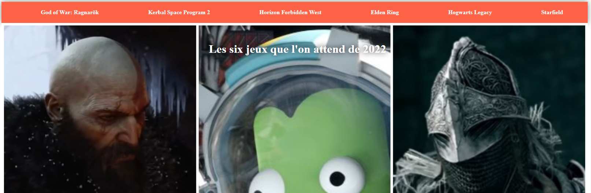
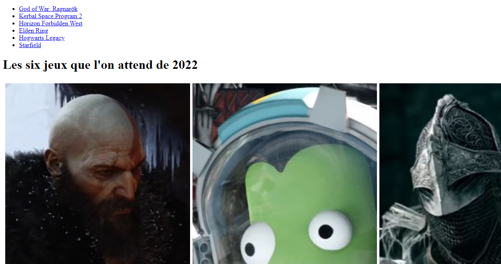
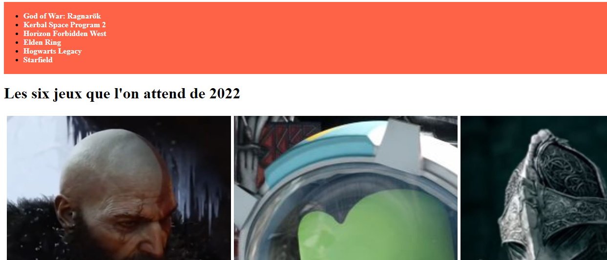
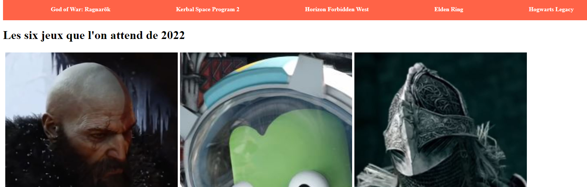
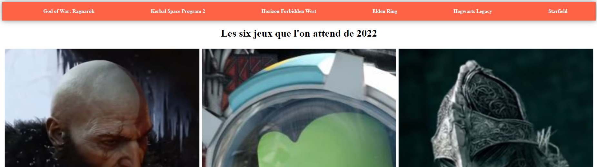
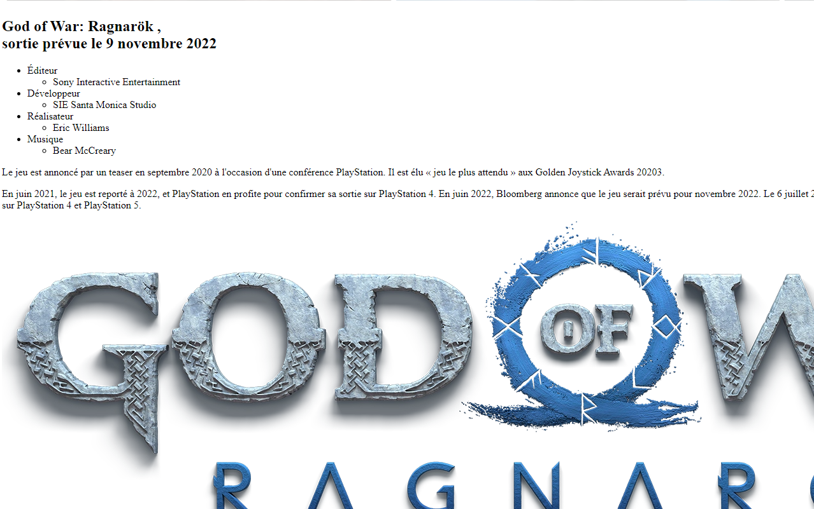
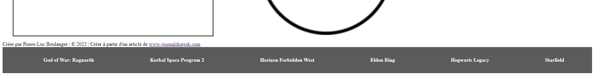
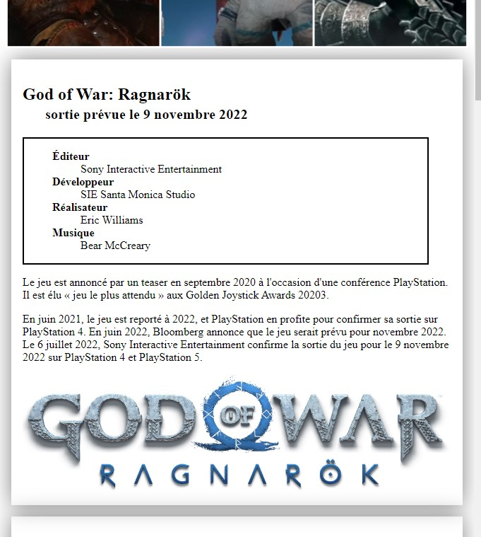
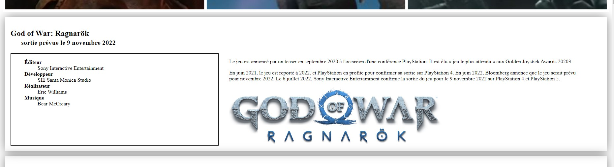

# Exercice dirigé -> Créer un site de A à Z.

## Objectif

Dans cette leçon, nous développerons une page web de A à Z avec du HTML et CSS.
Pour réaliser cette page, nous nous baserons sur l’article **Cap sur 2022: les
jeux que l'on attend le plus** du
site [Journal du Geek](https://www.journaldugeek.com/dossier/cap-sur-2022-les-jeux-que-lon-attend-avec-impatience/).
Néanmoins, nous limiterons cette page à une liste de six jeux. Pour avoir une
idée du résultat, vous pouvez regarder dans le dossier de l'exercice les
images `resultat_entete.png` et `resultat_body.png`.




Enfin, nous construirons étape par étape la page. Bien évidemment, il ne s’agit
que d’une méthode. Vous pouvez bâtir la structure et ajouter votre CSS à la fin.
C’est pour cette raison que le texte sera devisé en étape (en-tête, section,
footer, etc.) et chaque étape sera divisée en deux blocs. Un premier bloc (Le
HTML) traitera uniquement de la structure et expliquera nos choix et le second
bloc (Le CSS) traitera uniquement de la mise en page (style).

## Structure

Voici un exemple de la structure que nous allons faire

<style>
.ex-grid .grid-container {
    display: grid;
    grid-gap: 10px;
    background-color: #2196F3;
    padding: 10px;
    text-align: center;
    grid-template-columns: 1fr;
}
.ex-grid .grid-item {
    background-color: rgba(255, 255, 255, 0.8);
    color: #000;
    min-height: 80px;
    display: flex;
    flex-wrap: wrap;
    flex-direction: row;
    padding: 10px;
}
.ex-grid .max-item {
    width: 100%;
    text-align: left;
}
.ex-grid .complementaire {
    width: 35%;
}
.ex-grid .details {
    width: 65%;
}
</style>

<div class="ex-grid">
    <div class="grid-container" style="grid-template-areas:
        'header'
        'jeu'
        'jeu2'
        'jeu3'
        'jeu4'
        'jeu5'
        'jeu6'
        'footer';">
      <div class="grid-item" style="grid-area: header">
        <h3 class="max-item">Entête</h3>
        <h3 class="max-item">avec image</h3>
      </div>
      <div class="grid-item" style="grid-area: jeu">
          <div class="max-item">
              <h3>Jeu #1</h3>
          </div>
          <div class="complementaire">
              <h3>Info complémentaire</h3>
          </div>
          <div class="details">
              <h3>Détails</h3>
          </div>
      </div>
      <div class="grid-item" style="grid-area: jeu2">
          <div class="max-item">
              <h3>Jeu #2</h3>
          </div>
          <div class="complementaire">
              <h3>Info complémentaire</h3>
          </div>
          <div class="details">
              <h3>Détails</h3>
          </div>
      </div>
      <div class="grid-item" style="grid-area: jeu3">
          <div class="max-item">
              <h3>Jeu #3</h3>
          </div>
          <div class="complementaire">
              <h3>Info complémentaire</h3>
          </div>
          <div class="details">
              <h3>Détails</h3>
          </div>
      </div>
      <div class="grid-item" style="grid-area: jeu4">
          <div class="max-item">
              <h3>Jeu #4</h3>
          </div>
          <div class="complementaire">
              <h3>Info complémentaire</h3>
          </div>
          <div class="details">
              <h3>Détails</h3>
          </div>
      </div>
      <div class="grid-item" style="grid-area: jeu5">
          <div class="max-item">
              <h3>Jeu #5</h3>
          </div>
          <div class="complementaire">
              <h3>Info complémentaire</h3>
          </div>
          <div class="details">
              <h3>Détails</h3>
          </div>
      </div>
      <div class="grid-item" style="grid-area: jeu6">
          <div class="max-item">
              <h3>Jeu #6</h3>
          </div>
          <div class="complementaire">
              <h3>Info complémentaire</h3>
          </div>
          <div class="details">
              <h3>Détails</h3>
          </div>
      </div>
      <div class="grid-item" style="grid-area: footer"><h3>Pied de page</h3></div>
    </div>
</div>

Commençons par l'entête!

## L’en-tête, la porte d’entrée du site

Pour notre site, il faut une page d’accueil qui attire l'attention. Il faut un
menu horizontal de couleur claire avec un effet d’ombrage. Juste à côté, on peut
ajouter notre illustration avec le nom de l’article en gros.


De plus, il serait intéressant d’avoir une petite animation qui souligne le lien
dans le menu qui est survolé.

### Le HTML

Premièrement, décrivons l'en-tête. Il serait pratique de créer un
conteneur `<header>`. Dans ce conteneur, nous retrouverons deux enfants. Le
premier sera la barre de navigation `<nav>` et le second sera un conteneur
générique `<div>` dans lequel nous ajouterons notre titre et notre image. Voici
la structure générale :

````html

<header>
    <nav>
        <!-- La liste des liens sera ICI. -->
    </nav>

    <div>
        <h1>Les six jeux que l'on attend de 2022</h1>
        
    </div>
</header>
````

Pour faciliter la lecture, j'ai omis la liste de notre menu. Parlant de cette
dernière, nous utiliserons simplement une liste non ordonnée `<ul>`. Chaque puce
sera alors un lien. Grâce au CSS, nous pourrons effacer justement la puce.
Ainsi, notre barre de navigation sera :

````html

<nav>
    <ul>
        <li>
            <a href="#god-of-war">
                God of War: Ragnarök
            </a>
        </li>
        <li>
            <a href="#kerbal-space-program">
                Kerbal Space Program 2
            </a>
        </li>
        <li>
            <a href="#horizon">
                Horizon Forbidden West
            </a>
        </li>
        <li>
            <a href="#elden-ring">
                Elden Ring
            </a>
        </li>
        <li>
            <a href="#hogwarts-legacy">
                Hogwarts Legacy
            </a>
        </li>
        <li>
            <a href="#starfield">
                Starfield
            </a>
        </li>
    </ul>
</nav>
````



## Le CSS

### Le menu - Background et couleur de texte

Premièrement, ajoutons le menu. Notre barre sera d’un fond clair. J’ai choisi la
couleur tomato. Par la suite, nous voulons que le texte soit blanc et en gras.
Pour faciliter la lecture, nous ajoutons une marge intérieure en haut et en bas
de 0.25rem. Le code CSS sera alors :

````css
nav {
    background-color: tomato;
    padding: 0.25rem 0;
}


nav a {
    color: white;
    font-weight: bold;
    text-decoration: none;
}
````

Par défaut, le navigateur ajoute la couleur bleue et le texte souligné à tous
les liens `<a>`. Pour contourner, il faut alors spécifier au navigateur la
couleur des liens. De plus, on spécifie que nous souhaitons que cette couleur
soit appliqué seulement aux liens contenus dans une barre de navigation. Il
s’agit de l’appelle de style `nav ul a { /* ... */ }`.



### Le menu - Style de la liste et alignement vertical

Nous souhaitons un menu sans les puces. Pour cela, il suffit de retirer tout
style grâce à list-style. Enfin, comme nous souhaitons que ce style s’applique
uniquement aux listes dans une barre de navigation, nous donnerons l’appelle de
style nav ul.

````css
nav ul li {
    list-style: none;
}
````

De plus, nous souhaitons que les liens soient alignés sur une liste. Il faut
donc modifier l’affichage grâce à la propriété display. Notre balise devient
alors :

````css
nav ul li {
    display: inline;
    list-style: none;
}
````


### Le menu - centrer et étaler

Nous avons vu que le positionnement de bloc est facilité par l’affichage flex.
Nous allons donc décrire notre liste comme un conteneur `display: flex`. La
direction sera alors une ligne et l’alignement sera centré avec un petit rebord
sur les côtés. Ainsi, nous appliquons cet affichage à notre liste en entier et
non à chaque point.

````css
nav ul {
    display: flex;
    flex-wrap: wrap;
    justify-content: space-around;
    align-items: center;
}
````

Enfin, il ne faut pas oublier d’ajouter des marges intérieures pour être sûr que
les liens ne se touchent jamais.

````css
nav ul li {
    display: inline;
    list-style: none;
    padding: 0 0.5rem;
}
````



### Le menu - L’ombrage

Le petit ombrage créé par notre menu sera gris et sur une distance de 1rem.

````css
nav {
    background-color: tomato;
    padding: 0.25rem 0;
    box-shadow: 0 0 1rem gray;
}
````

### L’image à 100 % et titre centré

Pour que notre image prenne 100% de la largeur du conteneur (qui prend par
défaut 100 % du `<header>` qui prend lui-même 100% de la page), il suffit de lui
dire d’avoir une longueur de 100%. Pour le titre, il suffit de lui dire d’être
centré avec text-align.

````css
header h1 {
    text-align: center;
}


header img {
    width: 100%;
}
````



### Ajouter l’image sous le texte

Ce bout n’est pas évident. Le truc le plus simple est de vérifier sur internet
des codes libres qui permettent de le faire. Je vous propose, ici, une solution
parmi d’autres. En réalité, la seule propriété qui permet au texte de s’ajouter
par-dessus l’image est la position absolue `position: absolute`. Cette propriété
permet de positionner notre bloc (le titre) à un endroit précis par rapport au
conteneur. Ceci est possible puisque les éléments sont, par défaut, positionner
relativement (`position: relative`) l’un à la suite de l’autre. Par la suite, la
marge intérieure facilite la lecture. Enfin, nous lui spécifions que la boîte du
titre prendra 100 % de la largeur du conteneur (via `width`). Toujours par
défaut, une boîte qui est positionnée de façon absolue ne prendre que la taille
de son contenu.

````css
header h1 {
    text-align: center;
    position: absolute;
    width: 100%;
    padding-top: 2rem;
    color: white;
    text-shadow: 0 0 1rem black;
}


header img {
    display: block;
    width: 100%;
    height: auto;
}
````

### Animation de nos liens

Comme je l’expliquais en cours, l’animation en CSS est parfois difficile à
comprendre et à mettre en œuvre. J’ai trouvé une méthode simple pour cette
animation. Pour résumé le texte, nous n’appliquons pas de décoration au
texte (`text-decoration: underline`). Nous dessinons un background de fond
uniforme qui a une épaisseur de 2px et qui est situé sous le texte. Toutefois,
on spécifie que l’arrière-plan doit avoir une largeur nulle (0%). C’est la
propriété `background-size: largeur hauteur` qui réalise cet exploit.

De plus, la douce transition est possible avec la propriété transition (
référence). Elle définit la transition entre deux états d’un même élément. Ici,
c’est la transition entre normales et `:hover`. Nous lui donnons la propriété à
modifier et la durée de cette modification. Dans notre cas, nous changeons la
propriété `background-size` en 0.3 seconde.

````css
nav a {
    color: white;
    font-weight: bold;
    text-decoration: none;
    /* Aimation */
    background-image: linear-gradient(currentColor, currentColor);
    background-position: 0% 100%;
    background-repeat: no-repeat;
    background-size: 0% 2px;
    transition: background-size .3s;
}


nav a:hover, nav a:focus {
    background-size: 100% 2px;
}
````


## Les jeux

Pour nos jeux, nous utiliserons une idée simple, le titre du jeu sera à gauche
avec une marge sur le côté (2rem peut-être). Sous le titre, nous retrouverons le
sous-titre plus petit que le titre (disons 15% plus petit) et décalé avec le
titre. Il ne faudra pas oublier d’ajouter une virgule pour les lecteurs d’écran.

Par la suite, nous ajouterons à gauche une boîte d’information complémentaire et
à sa droite une boîte contenant le texte en premier et ensuite l’image. Cette
boîte aura une marge avec l’écran (tout comme l’information complémentaire) et
avec l’information complémentaire. Enfin, l’image doit prendre 60% de la largeur
de la seconde boîte.

### Le HTML

Le code HTML est relativement simplement. Les informations supplémentaires ont
été tirées de Wikipédia.

````html

<section id="god-of-war">
    <h2>
        God of War: Ragnarök <span>, </span>
        <br><span>sortie prévue le 9 novembre 2022</span>
    </h2>
    <div>
        <aside>
            <ul>
                <li>
                    <span>Éditeur</span>
                    <ul>
                        <li>Sony Interactive Entertainment</li>
                    </ul>
                </li>
                <li>
                    <span>Développeur</span>
                    <ul>
                        <li>SIE Santa Monica Studio</li>
                    </ul>
                </li>
                <li>
                    <span>Réalisateur</span>
                    <ul>
                        <li>Eric Williams</li>
                    </ul>
                </li>
                <li>
                    <span>Musique</span>
                    <ul>
                        <li>Bear McCreary</li>
                    </ul>
                </li>
            </ul>
        </aside>
        <div>
            <p>
                Le jeu est annoncé par un teaser en septembre 2020 à l'occasion
                d'une conférence PlayStation. Il est élu « jeu le plus attendu »
                aux Golden Joystick Awards 20203.
            </p>
            <p>
                En juin 2021, le jeu est reporté à 2022, et PlayStation en
                profite pour confirmer sa sortie sur PlayStation 4. En juin
                2022, Bloomberg annonce que le jeu serait prévu pour novembre
                2022. Le 6 juillet 2022, Sony Interactive Entertainment confirme
                la sortie du jeu pour le 9 novembre 2022 sur PlayStation 4 et
                PlayStation 5.
            </p>
            
        </div>
    </div>
</section>
````



### La virgule invisible

Pour effacer visuellement un élément HTML, il suffit d’appliquer la propriété
display: none. Pour simplifier la vie, nous pouvons créer une classe `.sr-only`
pour screen reader only qui permet d’effacer visuellement un élément mais en le
laissant visible pour les lecteurs d’écran qui lit seulement le HTML.

````css
.sr-only {
    display: none;
}
````

Alors, le HTML sera pour le titre seulement :

````html
<h2>
    God of War: Ragnarök <span class="sr-only">, </span>
    <br><span>sortie prévue le 9 novembre 2022</span>
</h2>
````

## Le sous-titre

Pour facilité notre vie, nous allons créer une classe .sous-titre qui permettra
d’ajouter facilement notre CSS. Le HTML devient alors&nbsp;:

````html
<h2>
    God of War: Ragnarök <span class="sr-only">, </span>
    <br><span class="sous-titre">sortie prévue le 9 novembre 2022</span>
</h2>
````

Ainsi, notre CSS impliquera un texte à 85% de sa taille avec une marge de 2rem.
De plus, nous appliquons, sur toute la section, des marges de 2rem avec la
fenêtre.

````css
section {
    margin: 0 2rem;
}


.sous-titre {
    font-size: 85%;
    margin-left: 2rem;
}
````

### Les informations complémentaires

Cette boîte aura un contour noir pour la distinguer. De plus, nous effacerons
les points de la liste et nous ajouterons une marge à droite de 2rem. Enfin,
limitons la boîte à une largeur de 35% de son conteneur. On ne veut pas qu’elle
prenne trop de place.

````css
aside {
    border: 2px outset black;
    margin-right: 2rem;
    width: 35%;
}


aside ul {
    list-style: none;
}
````

### Les sous-sections d’information complémentaire

Pour faciliter la lecture, les sous-sections d’information (éditeur,
développeur, concepteur, musique) pourraient être en gras pour faciliter la
lecture. Il suffit alors d’appeler le style sur les balises `<span>` contenues
dans `<aside>` et la liste `<ul>`.

````css
aside ul span {
    font-weight: bold;
}
````

L’image à 60% de largeur

Il suffit d’appeler l’image de notre conteneur à 60% tel que :

````css
section div img {
    width: 60%;
}
````

L’appel utilisé est suffisant, car nous recherchons une image `` contenue
dans un conteneur générique `<div>` lui-même dans notre section.


### Notre bloc sur la même ligne que l’info

Dans un premier temps, ajoutons une classe à notre conteneur qui contient notre
texte et notre image. Cette classe nous permettra de reconnaître rapidement
le `<div>` en question. Honnêtement, on finit rapidement par avoir trop de
conteneurs génériques. Pour cette fois, appelons cette classe `.texte-image`. De
plus, nous créons, dans le conteneur `<div>` supérieur, une classe .conteneur à
qui nous appliquerons notre affichage `display: flex` car cet affichage inclut à
la fois notre boîte d’information complémentaire et notre boîte `.texte-image`.
Le code HTML sera modifié tel que :

````html

<div class="conteneur">
    <aside>
        <ul>
            <li>
                <span>Éditeur</span>
                <ul>
                    <li>Sony Interactive Entertainment</li>
                </ul>
            </li>
            <li>
                <span>Développeur</span>
                <ul>
                    <li>SIE Santa Monica Studio</li>
                </ul>
            </li>
            <li>
                <span>Réalisateur</span>
                <ul>
                    <li>Eric Williams</li>
                </ul>
            </li>
            <li>
                <span>Musique</span>
                <ul>
                    <li>Bear McCreary</li>
                </ul>
            </li>
        </ul>
    </aside>
    <div class="texte-image">
        <p>
            Le jeu est annoncé par un teaser en septembre 2020 à l'occasion
            d'une conférence PlayStation. Il est élu « jeu le plus attendu » aux
            Golden Joystick Awards 20203.
        </p>
        <p>
            En juin 2021, le jeu est reporté à 2022, et PlayStation en profite
            pour confirmer sa sortie sur PlayStation 4. En juin 2022, Bloomberg
            annonce que le jeu serait prévu pour novembre 2022. Le 6 juillet
            2022, Sony Interactive Entertainment confirme la sortie du jeu pour
            le 9 novembre 2022 sur PlayStation 4 et PlayStation 5.
        </p>
        
    </div>
</div>
````

Ensuite, le CSS sera simplement le suivant. Nous en avons profité pour ajouter
une marge inférieure de 1rem à toute la section.

````css
section {
    margin-bottom: 1rem;
}


section .texte-image {
    width: 60%;
}


.conteneur {
    display: flex;
    flex-wrap: wrap;
}
````


## Le pied de page

Pour ce pied de page, gardons cela simple. Nous retrouverons le menu en gris (
#5b5b5b sélectionnez d’après la palette Material Design) sans ombrage. Pour le
reste, nous récupérons le menu précédent. Enfin, nous ajouterons une petite
bande en gris pâle (#c5c5c5 sélectionnez d’après la palette Material Design) qui
donne les informations de copyright.

### Le HTML

Les informations du copyright sont laissées dans un conteneur générique `<div>`
et le menu sera simplement une barre de navigation. Cette barre reste la même
que précédent puisqu’elles sont identiques. Seul le visuel change un peu.

````html

<footer>
    <div>
        Créer par <span>Prénom Nom</span> | &copy; 2022 | Créer à partir d'un
        article de <a
            href="https://www.journaldugeek.com/dossier/cap-sur-2022-les-jeux-que-lon-attend-avec-impatience/">www.journaldugeek.com</a>
    </div>
    <nav>
        <ul>
            <li>
                <a href="#god-of-war">
                    God of War: Ragnarök
                </a>
            </li>
            <li>
                <a href="#kerbal-space-program">
                    Kerbal Space Program 2
                </a>
            </li>
            <li>
                <a href="#horizon">
                    Horizon Forbidden West
                </a>
            </li>
            <li>
                <a href="#elden-ring">
                    Elden Ring
                </a>
            </li>
            <li>
                <a href="#hogwarts-legacy">
                    Hogwarts Legacy
                </a>
            </li>
            <li>
                <a href="#starfield">
                    Starfield
                </a>
            </li>
        </ul>
    </nav>
</footer>
````


### Le CSS

Si nous regardons rapidement notre création, nous remarquons que la barre de
navigation applique déjà des éléments visuels du menu précédent. Or, seuls
l’ombrage et la couleur de fond ne respectent pas nos directives. Rassurez-vous,
le CSS nous permet de modifier cette section simplement. Ajoutons uniquement un
code spécifique aux barres de navigations dans un pied de page (footer nav {}).
Ce bloc de style modifie uniquement la couleur de fond et il retire l’ombre.

````css
footer nav {
    background-color: #5b5b5b;
    box-shadow: none;
    padding: 1rem 0;
}
````



### La petite bande

Pour la petite bande, nous ajoutons une couleur de fond à notre conteneur
générique. Le texte est centré et nous appliquons une petite marge intérieure en
haut et en bas. Enfin, nous colorons le lien pour qu’il soit noir.

````css
footer div {
    background-color: #c5c5c5;
    text-align: center;
    padding: 1rem 0;
}


footer div a {
    color: black;
}
````


## Touche finale

N'oubliez pas d'ajouter tous les sections pour chaque jeu. C'est important de
tester le menu que tout fonctionne aussi!

## Aller plus loin

Voici quelques pistes d'améliorations possibles si vous voulez aller plus loin!

### Responsive

Testons notre site sur plusieurs résolutions d'écran avec l'outil de
développement du navigateur. On remarque que le contenu en général ce comporte
bien jusqu'à 900 pixels de largeur. La seule chose qui change est que les jeux
dans le menu ne rentrent plus sur une même ligne.

Pour cela, il faudrait modifier le `padding` sur le menu pour `padding: 0.5rem`.
Ce qui veut dire que le `padding` s'applique sur tous les côtés au lieu de
seulement gauche-droite.

Par contre, le menu doit être plus compliqué à sélectionner en mobile ou
tablette, ce serait bien de le forcer en colonne. C'est pour cela qu'à 700
pixels de largeur et moins j'ai changé le `flex-direction` des éléments du menu.

````css
@media (max-width: 700px) {
    nav ul {
        flex-direction: column;
    }
}
````

On remarque aussi vers 800 pixels de largeur que le texte et l'image ne prend
pas toute la page. Notre utilisation de la largeur en pourcentage ne convient
pas pour le mobile! Une façon de corriger serait d'utiliser le CSS Grid à la
place. Par contre, on peut très bien arranger cela avec les **Flexbox**.

Pour corriger, une façon est de remettre le pourcentage à 100% pour chaque
section ou de remplacer l'utilisation de pourcentage pour un `min-width: XYZpx`

````css
@media (max-width: 800px) {
    aside {
        width: 100%;
    }

    section div img {
        width: 100%;
    }

    section .texte-image {
        width: 100%;
    }
}
````

Avec cela, on remarque que notre site est bon jusqu'à une largeur très petite!
Bien joué!



### Un peu plus de séparation!

Je trouve qu'il manque une séparation entre les jeux. je vois deux possibilités.
C'est à votre guise, mais une ligne de quelques pixels ou une boite avec une
ombre pourrait entourer la `<section>` du jeu.

Exemple avec une boite:

````css
section {
    margin: 0 0.5rem;
    box-shadow: 0 0 2rem gray;
    padding: 1rem;
}

#god-of-war {
    margin-top: 1rem;
}
````

Dans le cas de la boîte, il faut s'assurer de mettre un `padding` pour ne pas
que le texte soit sur le bord de la boîte. De plus, aussurez-vous qu'il est une
espace entre l'entête et le premier jeu.



## Conclusion

C’est la fin de notre exemple dirigé. Bien évidemment, il s’agit d’un exemple
parmi tant d’autres. Il est possible d’ajouter du contenu, de modifier certains
visuels ou de changer le style graphique. N'hésitez pas à regarder sur Internet
différentes méthodes et techniques pour améliorer vos talents de designer web.

------------------------------------------------------------------------

