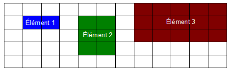
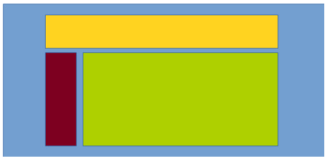
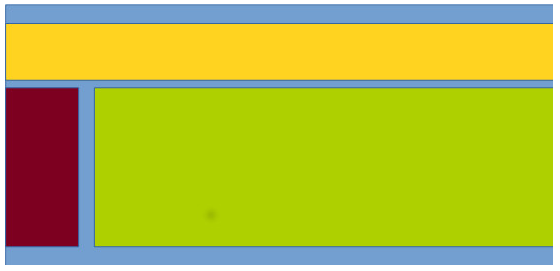
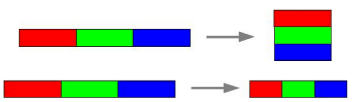
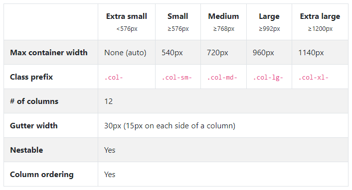
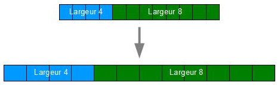
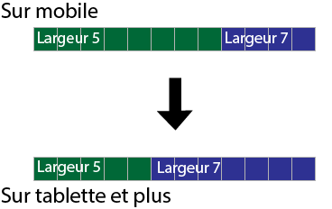
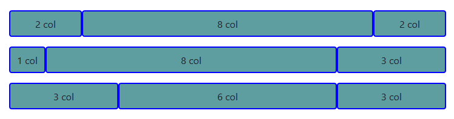
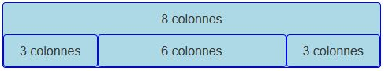
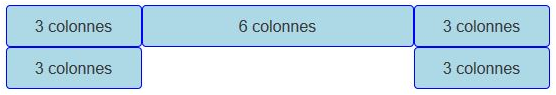

# Bootstrap et sa grille

L’organisation spatiale des pages web est l’une des premières préoccupations lorsque l’on crée un site web. Prévoit-on une bannière ? Faut-il un espace pour un menu à gauche ou en haut ? Y aura-t-il des blocs sur un des côtés pour recevoir certaines fonctionnalités comme la connexion ou des infos ? Faut-il prévoir un bas de page ?

Bootstrap ne répond évidemment pas à ces questions, mais il peut grandement vous faciliter la tâche avec son système de grille, pour obtenir le résultat que vous souhaitez.

## Présentation de la grille
### Le principe

Une grille est tout simplement un découpage en cellules :

<style>
.table td{
  width: 40px;
  height: 40px;
  border: 2px solid black;
}
</style>

<table class="table">
    <tr>
        <td></td>
        <td></td>
        <td></td>
        <td></td>
        <td></td>
        <td></td>
        <td></td>
        <td></td>
        <td></td>
        <td></td>
        <td></td>
        <td></td>
    </tr>
    <tr>
        <td></td>
        <td></td>
        <td></td>
        <td></td>
        <td></td>
        <td></td>
        <td></td>
        <td></td>
        <td></td>
        <td></td>
        <td></td>
        <td></td>
    </tr>
    <tr>
        <td></td>
        <td></td>
        <td></td>
        <td></td>
        <td></td>
        <td></td>
        <td></td>
        <td></td>
        <td></td>
        <td></td>
        <td></td>
        <td></td>
    </tr>
</table>

<div class="spacer"></div>

On peut alors décider d’organiser du contenu en utilisant pour chaque élément une ou plusieurs cellules comme pour le grille CSS :



La grille de Bootstrap comporte 12 colonnes au lieu de 3 comme dans l’illustration précédente. Ainsi le navigateur placera nos éléments sur cette grille en fonction des colonnes et des lignes.

### Terminologie

Une grille est découpée en rangées (appelées row, parce que tout est en anglais) et colonnes (col).

Le découpage en colonnes est tout simplement une division en pourcentage de la largeur de la fenêtre de visualisation et correspond donc à ce qu’on vient de voir. En revanche, il n’en est pas vraiment de même pour les rangées. Ces dernières ont la hauteur de leur contenu (voir figure suivante).

<div style="page-break-after: always;"></div>

<table class="table">
    <tr>
        <td></td>
        <td></td>
        <td></td>
        <td></td>
        <td></td>
        <td></td>
        <td></td>
        <td></td>
        <td></td>
        <td></td>
        <td></td>
        <td></td>
    </tr>
    <tr>
        <td style="background: lightblue;">Je suis petit</td>
        <td></td>
        <td></td>
        <td></td>
        <td></td>
        <td style="background: lightgreen;">Je suis un gros élément qui grossit la case</td>
        <td></td>
        <td></td>
        <td></td>
        <td></td>
        <td></td>
        <td></td>
    </tr>
    <tr>
        <td></td>
        <td></td>
        <td></td>
        <td></td>
        <td></td>
        <td></td>
        <td></td>
        <td></td>
        <td></td>
        <td></td>
        <td></td>
        <td></td>
    </tr>
</table>

**Moralité** : une rangée prend la hauteur du plus gros élément qu’elle contient. Puisque la largeur des colonnes est contrainte, le flux des données s’écoule verticalement, ce qui est un comportement HTML classique. Il faudra en tenir compte lors de la mise en page.

## Organisation de la grille

**Bootstrap** est essentiellement un fichier CSS. Il comporte de nombreuses classes que l’on peut utiliser directement dans les balises HTML. La version 5 utilise les **Flexbox** (display: flex). Avec **Bootstrap** vous n’avez pas réellement besoin d’approfondir le sujet parce que le système de grille masque en grande partie le système utilisé.

La première classe à connaître est `row`, qui représente une rangée.

### La classe `.row`

Cette classe permet de définir une ligne de la grille. Elle contient **les 12 colonnes** de la grille. Il s’agit d’une classe CSS et donc, elle est accessible directement dans l’attribut class. Pour facilité son application, nous plaçons, en général, la classe sur un conteneur générique `<div>` comme ceci :

````HTML
<!-- Code précédent -->
<div class="row"> <!-- Contient la ligne de la grille -->
    <!-- Contenu de la ligne -->
</div>
<!-- Code suivant -->
````

La (les) seconde(s) classe(s) à apprendre est `col-00`, qui représente la largeur selon le nombre de colonnes.

### La classe `.col-00`

Comme nous l’avons dit précédemment, la grille **Bootstrap contient 12 colonnes**. Par défaut, un élément contenu dans une ligne prendra 12 colonnes soit la totalité de la ligne. Toutefois, imaginez que vous souhaitez créer trois boîtes de même largeur et sur la même ligne.


Pour obtenir ce résultat, nous devons spécifier le nombre de colonnes à utiliser. Cette responsabilité est dédiée à la classe `.col-00` où les chiffres représentent le nombre de colonnes. Dans l’exemple précédent, nos boîtes prennent un tiers (1/3) des 12 colonnes soit quatre colonnes. Ainsi, chaque boîte aura la classe .col-4. Aussi, nous appliquons généralement cette classe à un conteneur générique `<div>`. Donc, l’exemple précédent s’écrit comme suit :

````HTML
<div class="row">
    <!-- Première boîte -->
    <div class="col-4">
        <p>One of three columns</p>
    </div>
    <!-- Deuxième boîte -->
    <div class="col-4">
        <p>One of three columns</p>
    </div>
    <!-- Troisième boîte -->
    <div class="col-4">
        <p>One of three columns</p>
    </div>
</div>
````

En réalité, Bootstrap ajoute un espace entre les colonnes que l’on appelle des gouttières.

### La classe no-gutters

Dans la définition de base des colonnes, Bootstrap ajoute une gouttière d’environ `1rem.` Autant que cet espace peut être utile, autant qu’il peut nuire. Ainsi, nous pouvons supprimer cette gouttière. Il suffit la classe `.g-0` à notre conteneur avec la classe `.row` comme ceci :

````html
<!-- Il n'y aura pas d'espace entre les colonnes. -->
<div class="row g-0">
    <!-- Contenu de la ligne -->
</div>
````

On comprend que pour modifier la goutière on peut changer la valeur comme cela -> `.g-x`. Par défaut la goutière est de `1.5rem`.

## Le conteneur de grille

Une grille doit toujours se placer dans un conteneur. Bootstrap propose deux types de conteneurs selon l’effet désiré.

Un conteneur de largeur fixe (qui s’adapte évidemment selon la largeur de l’écran utilisé) :



La classe à utiliser est `container`. À l’intérieur, nous plaçons nos lignes. L’exemple précédent peut être décrit comme suit :

````html
<div class="container">
 <!-- La première ligne jaune -->
    <div class="row">
        <div class="col-12 bg-jaune">
            <!-- Blablabla -->
        </div>
    </div>
    
    <!-- La deuxième ligne -->
    <div class="row">
        <!-- La boîte rouge -->
        <div class="col bg-rouge">
            <!-- Blablabla -->
        </div>
        <!-- La boîte verte -->
        <div class="col-11 bg-vert">
            <!-- Blablabla -->
        </div>
    </div>
</div>
````
Un conteneur à largeur « fluide » qui occupe toujours toute la largeur disponible :



La classe à utiliser est `container-fluid`. À l’intérieur, nous plaçons nos lignes. L’exemple précédent peut être décrit comme suit :

````html
<div class="container-fluid">
 <!-- La première ligne jaune -->
    <div class="row">
     <div class="col-12 bg-jaune">
            <!-- Blablabla -->
        </div>
 </div>
    
    <!-- La deuxième ligne -->
    <div class="row">
        <!-- La boîte rouge -->
        <div class="col bg-rouge">
            <!-- Blablabla -->
        </div>
        <!-- La boîte verte -->
        <div class="col-11 bg-vert">
            <!-- Blablabla -->
        </div>
    </div>
</div>
````

## Les colonnes en fonction de l’écran

Mais que se passe-t-il pour les éléments d’une page web lorsque la fenêtre diminue ou s’élargit ?

On peut envisager deux hypothèses : 
- Les éléments se redimensionnent en restant positionnés, 
- Ils s’empilent quand la fenêtre devient plus étroite et se positionnent côte à côte quand elle s’élargit. 

Plutôt que de réduire les éléments au risque de les rendre illisibles, le choix a été fait de les empiler petit à petit quand la fenêtre devient plus étroite.



Pour résoudre ce problème, Bootstrap inclut cinq classes spécialisées selon les médias (écrans). Les cinq médias sont :

- les très petits écrans comme les téléphones intelligents en mode portrait (moins de 576px),
- les petits écrans comme les téléphones intelligents en mode paysage (plus de 576px mais moins de 768px),
- les écrans moyens comme les tablettes (plus de 768px mais moins de 992px),
- les grands écrans comme les portables (plus de 992px mais moins de 1200px),
- les très grands écrans comme les ordinateurs de bureau (plus de 1200px).
- les très très grands écrans (plus de 1400px).

Vous trouverez à la figure suivante le tableau de la documentation officielle pour illustrer les différences de réaction selon la catégorie et les classes associées.



### Le nom des classes est intuitif :

- rien pour les très petits écrans (valeur de référence)
- `sm` pour small,
- `md` pour medium,
- `lg` pour large,
- `xl` pour x-large.
- `xxl` pour xx-large.

### Un exemple de gestion de largeur selon l'écran

Pour avoir un élément de 4 colonnes de large lié à un élément de 8 colonnes de large sur un smartphone en mode portrait (et donc aussi pour tous les formats au-dessus) on a :

````HTML
<div class="row">
    <div class="col-4"><p>Largeur 4</p></div>
    <div class="col-8"><p>Largeur 8</p></div>
</div>
````

La figure suivante illustre ce code avec l’effet quand on passe sur un écran plus grand comme une tablette.



Voici la version « tablette » :

````HTML
<div class="row">
    <div class="col-md-4"><p>Largeur 4</p></div>
    <div class="col-md-8"><p>Largeur 8</p></div>
</div>
````

Mais comment fait-on pour que nos blocs s’adaptent au type d’écran ?

Et si `.col` et `.col-md` sont indépendants ?

Rappelez-vous, nous avons parlé des media queries. Grâce à ces règles, nous pouvons appliquer des styles spécifiques selon le type de média. Heureusement pour nous, les différentes grilles Bootstrap (`sm`, `md`, etc.) sont définies grâce à ces règles. Ainsi, si je donne la classe `.col-md-5` tous les écrans dont la taille est plus grande que 720px alors, le conteneur doit prendre **5 colonnes**. De plus, je peux lui dire que tous les écrans plus petits doivent prendre **7 colonnes** avec `.col-7`.



````HTML
<div class="row">
    <div class="col-7 col-md-5"><p>Largeur 5</p></div>
    <div class="col-5 col-md-7"><p>Largeur 7</p></div>
</div>
````

## Essayons concrètement

Pour cette partie, essayons différentes grilles.

### La base : 2 colonnes égales


Pour avoir deux colonnes égaux, on utilise `.col-6` car la grille totale fait 12 colonnes. Le code source de l’exemple précédent est :

````HTML
<div class="container">
    <div class="row">
        <div class="col-6">
          6 col
        </div>
        <div class="col-6">
          6 col
        </div>
    </div>
</div>
````

### Une autre base : Le calcul automatique

Pour avoir le même effet, mais sans calculer la largeur, nous pouvons utiliser la classe `.col`. Le navigateur calculera automatiquement la largeur des blocs. Ainsi, le code suivant à le même résultat que l’exemple précédent.

````HTML
<div class="container">
    <div class="row">
        <div class="col">
          6 col
        </div>
        <div class="col">
          6 col
        </div>
    </div>
</div>
````
### Une ligne avec différente colonne

Il est aussi possible d’avoir différentes largeurs pour vos boîtes. Pour cela, il suffit d’utiliser une classe avec une taille différente. Prenons l’exemple suivant :



Se code comme suit :

````HTML
<div class="container">
    <div class="row">
        <div class="col">
            2 col
        </div>
        <div class="col-8">
            8 col
        </div>
        <div class="col">
            2 col
        </div>
    </div>
</div>

<div class="container">
    <div class="row">
        <div class="col">
            1 col
        </div>
        <div class="col-8">
            8 col
        </div>
        <div class="col-3">
            3 col
        </div>
    </div>
</div>

<div class="container">
    <div class="row">
        <div class="col">
            3 col
        </div>
        <div class="col-6">
            6 col
        </div>
        <div class="col-3">
            3 col
        </div>
    </div>
</div>
````
Et si on dépasse 12 colonnes ?

Prenons le code suivant :

````HTML
<div class="container">
    <div class="row">
        <div class="col-8">
          Elément 1
        </div>
        <div class="col-6">
          Elément 2
        </div>
        <div class="col-2">
          Elément 3
        </div>
        <div class="col-6">
          Elément 4
        </div>
    </div>
</div>
````

Le résultat est le suivant :


Heureusement, le navigateur effectue, automatiquement, un retour de ligne s’il y a un dépassement.

## Une colonne automatique

La classe `.col-auto` permet d’ajuster le contenu d’un bloc automatiquement à la largeur de son contenu.


S’écrit comme suit :

````HTML
<div class="container">
    <div class="row">
        <div class="col">
          Répartition du reste
        </div>
        <div class="col col-auto">
          Contenu auto
        </div>
        <div class="col">
          Répartition du reste
        </div>
    </div>
</div>
````

Pour avoir une ligne dans une ligne



S’écrit simplement comme :

````HTML
<div class="row">
  <div class="col-8">8 colonnes
    <div class="row">
      <div class="col-3">3 colonnes</div>
      <div class="col">6 colonnes</div>
      <div class="col-3">3 colonnes</div>
    </div>
  </div>
</div>
````

## Le saut de colonne

Les sauts de ligne sont décrits par une classe selon la syntaxe suivante :

`{propriété}{côtés}-{support (optionnel)}-auto`

La propriété définit le type :

- `m` : marge
- `p` : remplissage (padding)
  
Les côtés définissent la position :
- `t` : haut (top)
- `e` : droite (end)
- `b` : bas (bottom)
- `s` : gauche (start)
- `x` : gauche et droite (axe x)
- `y` : haut et bas (axe y)
  
Le support représente l’écran à utiliser (`sm`, `md`, etc.) Cette valeur est optionnelle. Si nous ne l’écrivons pas, le deuxième tiret l’est aussi.

Par exemple, la classe `.ms-auto` définit une marge automatique à gauche alors que la classe `.me-auto` fait la même chose pour la droite. Avec la même logique, la classe `.ms-lg-auto` définit une marge automatique à gauche pour les écrans larges et plus seulement. Donc, l’exemple :



S’écrit comme :

````HTML
<div class="row">
  <div class="col-3">3 colonnes</div>
  <div class="col">6 colonnes</div>
  <div class="col-3">3 colonnes</div>
</div>
<div class="row">
  <div class="col-3">3 colonnes</div>
  <div class="col-3 ms-auto">3 colonnes</div>
</div>
````

--------------------------------
Note de cours pour la session d'automne 2022
