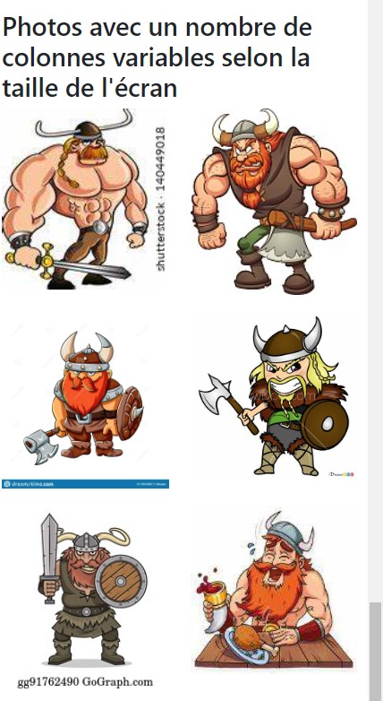

# Exemple de mise en page simple

L’intérêt principal d’une grille est de réaliser une mise en page. Maintenant que vous savez comment utiliser la grille de Bootstrap nous allons voir dans ce chapitre quelques exemples pour structurer correctement une page.

## Structure de base

Commençons par quelque chose de simple avec une en-tête, un menu à gauche, une section à droite et un pied de page :

````html
<div class="container">
  <header class="row">
    <div class="col">
      Entete
    </div>
  </header>
  <div class="row">
    <nav class="col-lg-2">
      Menu
    </nav>
    <section class="col-lg-10">
      Section
    </section>
  </div>
  <footer class="row">
    <div class="col">
      Pied de page
    </div>
  </footer>
</div>
````

### Le résultat se trouve à la figure suivante.


### Le résultat pour des petits écrans

J’ai utilisé les classes pour grand écran avec les classes `col-lg-*` pour le menu et la section. On aura évidemment le même rendu sur très grand écran. Par contre, à la réduction, on se retrouve avec un empilage dès qu’on passe en dessous de `992px`.


Si je veux que ma mise en forme reste la même pour les écrans moyens, comment faire ? Il suffit d’utiliser les classes `col-md-*` à la place de `col-lg-*`, ce qui a pour effet de déplacer la limite à `768px`. De la même façon, l’utilisation des classes `col-sm-*` déplace la limite à `576px`.

## Mise en page plus complexe

Considérons maintenant un cas un peu plus riche :

````html
<div class="container">
  <header class="row">
    <div class="col">
      Entete
    </div>
  </header>
  <div class="row">
    <nav class="col-md-2">
      Menu
    </nav>
    <section class="col-md-10">
      Section
      <div class="row">
        <article class="col-lg-10">
          Article
        </article>
        <aside class="col-lg-2">
          Aside
        </aside>
      </div>
    </section>
  </div>
  <footer class="row">
    <div class="col">
      Pied de page
    </div>
  </footer>
</div>
````

<div style="page-break-after: always;"></div>

### Le résultat se trouve à la figure suivante pour un écran grand `(col-lg-*)` ou très grand `(col-xl-*)`:


### Le résultat pour les écrans moyens et petit

On a conservé l’en-tête et le pied de page, ainsi que le menu, mais on a intégré dans le contenu un `article` et un `aside`. L’ensemble est prévu pour fonctionner sur grand et très grand écran. Pour les tablettes, on se retrouve avec un empilage pour le contenu de la section (utilisation des classes `col-md-*` pour tout sauf `article` et `aside`) :


Et comme on n’a rien prévu de spécial pour les smartphones, tout s’empile :


<div style="page-break-after: always;"></div>

### Enrichissons encore la mise en page:

````html
<div class="container">
  <header class="row">
    <div class="col">
      Entete
    </div>
  </header>
  <div class="row">
    <nav class="col-md-2">
      Menu
    </nav>
    <section class="col">
      Section
      <div class="row">
        <article class="col-lg-10">
          Article
        </article>
        <div class="col">
          <div class="row">
            <aside class="col">
              Aside 1
            </aside>
            <div class="w-100"></div>
            <aside class="col">
              Aside 2
            </aside>
          </div>
        </div>
      </div>
    </section>
  </div>
  <footer class="row">
    <div class="col">
      Pied de page
    </div>
  </footer>
</div>
````

Le résultat se trouve à la figure suivante pour un écran grand ou très grand :


Maintenant nous avons 2 asides à côté de l’article. Pour y arriver, il faut 2 niveaux d’imbrication.

### Le résultat pour les tablettes (écrans moyens)

L’ensemble est prévu pour fonctionner sur écrans grand et très grands. Pour les tablettes, on se retrouve avec un empilage pour le contenu de la section (utilisation de classes col-lg-* pour tout ce qui est dans la section):


### Le résultat pour les mobiles (petits écrans)

Et comme on n’a rien prévu de spécial pour les smartphones, tout s’empile :


## Combinaison de classes `col-*`

Pour le moment nous avons utilisé juste une classe `col-*` pour chaque élément HTML. Mais il est parfois nécessaire d’en utiliser plusieurs lorsqu’on veut un rendu différent selon le support. Le plus simple est de voir un exemple. Je veux sur une page avoir des petites photos côte à côte. Supposons que je parte de cette structure pour cette partie de la page :

````CSS
[class*="col"] { margin-bottom: 20px; }
img { width: 100%; }
body { margin-top: 10px; }
````

````html

<div class="container">
    <section class="row">
        <div class="col-lg-2">
        </div>
        <div class="col-lg-2">
        </div>
        <div class="col-lg-2">
        </div>
        <div class="col-lg-2">
        </div>
        <div class="col-lg-2">
        </div>
        <div class="col-lg-2">
        </div>
        <div class="col-lg-2">
        </div>
        <div class="col-lg-2">
        </div>
        <div class="col-lg-2">
        </div>
        <div class="col-lg-2">
        </div>
        <div class="col-lg-2">
        </div>
        <div class="col-lg-2">
        </div>
    </section>
</div>
````
Le rendu sur grand et très grand écran est parfait avec 6 photos sur la largeur :


<div style="page-break-after: always;"></div>

Mais ça se gâte quand je rétrécis la fenêtre, puisque je sais qu’en dessous de `992px` les éléments s’empilent. Alors, je me retrouve avec une image sur la largeur, et comme je les ai prévues en basse résolution, elles pixelisent :


### La solution

L’idéal serait d’avoir :

- Sur moyen et grand écran : 6 images sur la largeur.
- Sur tablette : 4 images sur la largeur.
- Sur smartphone en mode paysage : 3 images sur la largeur.
- Sur smartphone en mode portrait : 2 images sur la largeur.

<div style="page-break-after: always;"></div>

Comment réaliser cela ? Tout simplement en combinant les classes `col-*` :

````html

<div class="container">
    <section class="row">
        <div class="col-6 col-sm-4 col-md-3 col-lg-2">
            
        </div>
        <div class="col-6 col-sm-4 col-md-3 col-lg-2">
            
        </div>
        <div class="col-6 col-sm-4 col-md-3 col-lg-2">
            
        </div>
        <div class="col-6 col-sm-4 col-md-3 col-lg-2">
            
        </div>
        <div class="col-6 col-sm-4 col-md-3 col-lg-2">
            
        </div>
        <div class="col-6 col-sm-4 col-md-3 col-lg-2">
            
        </div>
        <div class="col-6 col-sm-4 col-md-3 col-lg-2">
            
        </div>
        <div class="col-6 col-sm-4 col-md-3 col-lg-2">
            
        </div>
        <div class="col-6 col-sm-4 col-md-3 col-lg-2">
            
        </div>
        <div class="col-6 col-sm-4 col-md-3 col-lg-2">
            
        </div>
        <div class="col-6 col-sm-4 col-md-3 col-lg-2">
            
        </div>
        <div class="col-6 col-sm-4 col-md-3 col-lg-2">
            
        </div>
    </section>
</div>
````

<div style="page-break-after: always;"></div>


Voici le résultat sur tablette (classes col-md-3 actives) :


<div style="page-break-after: always;"></div>

Voici le résultat sur smartphone en mode paysage (classes col-sm-4 actives) :


<div style="page-break-after: always;"></div>

Voici enfin le résultat sur smartphone en mode portrait (classes col-6 actives) :



On a donc obtenu facilement une adaptation de la présentation des photos en fonction du support utilisé pour les visualiser.

<div style="page-break-after: always;"></div>

## Exercice de mise en page

Réaliser la mise en page présentée dans ce document pour la version grand écran, tablette et mobile. Nous allons ajouter quelques photos de Vikings pour rendre notre site plus attrayant! Partez de template de base de Léa de l'exercie du cours #10.

Voici le résultat pour les grands écrans :


Vouz devez avoir 5 images sur la première ligne avec des colonnes de 2 de largeur. Ajoutez une marge automatique sur la gauche pour remplacer l'espace manquant `ms-auto`. Même chose pour la deuxième ligne, mais avec la marge automatique à droite `me-auto`.

Reprenez le même contenu, mais il doit donner ceci pour la version tablette :


Maintenant, chaque colonne doit prendre 3 de largeurs. Remplacer la marge pour le dernier élément pour la mettre des deux côtés de façons automatique. Le truc est d'utiliser la marge selon la dimension de l'écran comme `me-md-auto`. Vous pouvez annuler l'autre marge avec `me-lg-0`.

Reprenez le même contenu, mais il doit donner ceci pour la version mobile :


Pour la dernière version, les images doivent prendrent 6 colonnes de largeur.

------------------------------------------
Exemple pour le cours de Développement Web 1
