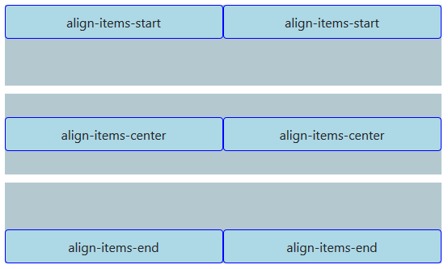
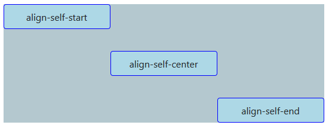
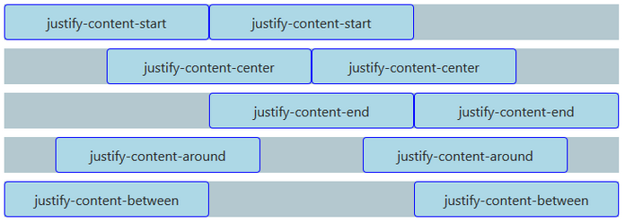
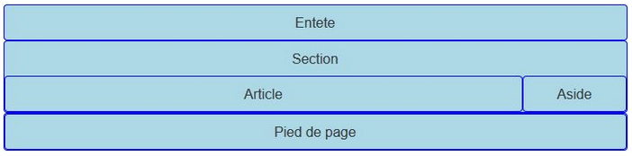
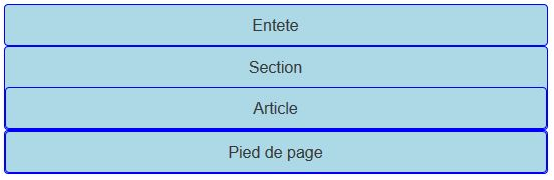
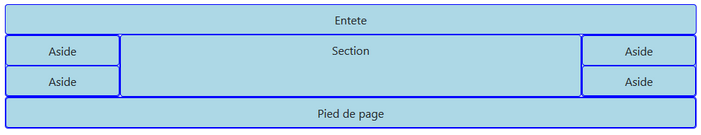
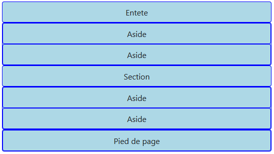
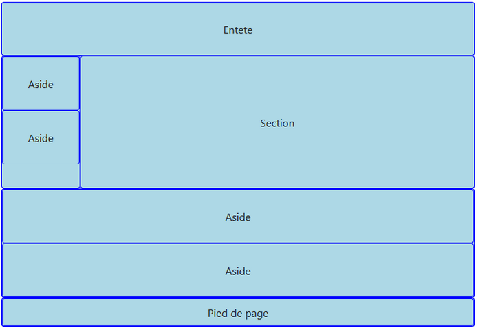
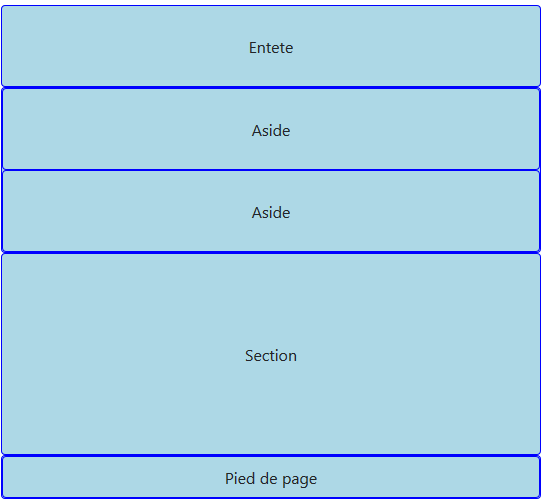

# Bootstrap alignement et visibilité

Dans ce chapitre, nous allons voir comment aligner des éléments avec flexbox. Ensuite nous verrons les classes que Bootstrap nous offre pour masquer ou faire apparaître des éléments selon le support utilisé. Et tant qu’à faire nous allons aussi poursuivre l’apprentissage de l’organisation de l’espace avec la grille.

## Aligner verticalement

### Aligner globalement

Un avantage d'utiliser les **flexbox** est la grande facilité que l’on obtient pour les alignements. On dispose de 3 classes pour aligner verticalement au niveau d’une ligne :

````HTML
<div class="container">
  <div class="row align-items-start">
    <div class="col">
      align-items-start
    </div>
    <div class="col">
      align-items-start
    </div>
  </div>
  <div class="row align-items-center">
    <div class="col">
      align-items-center
    </div>
    <div class="col">
      align-items-center
    </div>
  </div>
  <div class="row align-items-end">
    <div class="col">
      align-items-end
    </div>
    <div class="col">
      align-items-end
    </div>
  </div>
</div>
````



La première n’est pas vraiment utile parce que c’est la valeur par défaut. Par contre les deux autres sont les bienvenues. Sans **flexbox**, il n’est pas si facile d’obtenir le même résultat. On peut adapter cet alignement selon le support avec des classes `align-items-sm-*`, `align-items-md-*`.

## Aligner individuellement

On peut également traiter chaque élément individuellement :

````html
<div class="container">
  <div class="row">
    <div class="col align-self-start">
      align-self-start
    </div>
    <div class="col align-self-center">
      align-self-center
    </div>
    <div class="col align-self-end">
      align-self-end
    </div>
  </div>
</div>
````



On peut aussi adapter cet alignement selon le support avec des classes `align-self-sm-*`, `align-self-md-*`. Pour la visualisation de ces deux exemples, j’ai ajouté ces règles :

````css
.row {
  background-color: #b4c8cf;
  height: 200px;
  margin-bottom: 10px;
}
````

### Aligner horizontalement

On peut aussi aligner horizontalement en faisant de la justification :

````HTML
<div class="container">
  <div class="row justify-content-start">
    <div class="col-4">
      justify-content-start
    </div>
    <div class="col-4">
      justify-content-start
    </div>
  </div>
  <div class="row justify-content-center">
    <div class="col-4">
      justify-content-center
    </div>
    <div class="col-4">
      justify-content-center
    </div>
  </div>
  <div class="row justify-content-end">
    <div class="col-4">
      justify-content-end
    </div>
    <div class="col-4">
      justify-content-end
    </div>
  </div>
  <div class="row justify-content-around">
    <div class="col-4">
      justify-content-around
    </div>
    <div class="col-4">
      justify-content-around
    </div>
  </div>
  <div class="row justify-content-between">
    <div class="col-4">
      justify-content-between
    </div>
    <div class="col-4">
      justify-content-between
    </div>
  </div>
</div>
````


On peut aussi adapter cet alignement selon le support avec des classes `justify-content-sm-*`, `justify-content-md-*`.

## Les classes pour masquer ou afficher

Dans tous les exemples que nous avons vus jusqu’à présent on s’est contenté de modifier la disposition des éléments selon le support. Mais il arrive aussi que l’on ait besoin de masquer ou afficher ces éléments selon les cas. Pour réaliser cela, Bootstrap nous propose aussi des classes.

Voici les classes d’affichage (`display`) de Bottstrap :

- `d-none`
- `d-inline`
- `d-inline-block`
- `d-block`
- `d-table`
- `d-table-cell`
- `d-table-row`
- `d-flex`
- `d-inline-flex`

Ces classes se comprennent avec leur appellation, par exemple pour `d-block` on a cette simple règle :

````css
.d-block {
  display: block !important;
}
````

Nous allons ici nous intéresser à la classe `d-none` qui utilise cette règle :

````css
.d-none {
  display: none !important;
}
````

Le point intéressant c’est que toutes les classes listées ont leurs variantes selon les supports, donc pour `d-none` on dispose de :

- `d-sm-none`
- `d-md-none`
- `d-lg-none`
- `d-xl-none`

Autrement dit on peut régler la visibilité d’un élément selon le support avec ces classes! Prenons un exemple pour illustrer cela :

````HTML
<div class="container">
  <header class="row">
    <div class="col">
      Entete
    </div>
  </header>
  <div class="row">
    <section class="col">
      Section
      <div class="row">
        <article class="col-md-10">
          Article
        </article>
        <aside class="col d-none d-md-block">
          Aside
        </aside>
      </div>
    </section>
  </div>
  <footer class="row">
    <div class="col">
      Pied de page
    </div>
  </footer>
</div>
````

On a une mise en page simple avec cet aspect pour tablettes et grands écrans :



Pour les smartphones on veut que le `<aside>` disparaisse. On utilise  de base la classe `d-none` pour empêcher l’affichage et la classe `d-md-block` pour avoir l’affichage à partir des tablettes. On obtient donc cet affichage :



## Mise en page avec visibilité

Nous allons mettre en œuvre ce que nous venons de voir avec un nouvel exemple de mise en page. Le but est d’obtenir cette mise en page pour grands et très grands écrans :



Voici un premier code pour cette mise en page :

````html
<div class="container">

  <header class="row">
    <div class="col">
      Entete
    </div>
  </header>

  <div class="row">

    <div class="col-lg-2">
      <div class="row">
        <aside class="col-12">
          Aside
        </aside>
        <aside class="col-12">
          Aside
        </aside>
      </div>
    </div>

    <section class="col">
      Section
    </section>

    <div class="col-lg-2">
      <div class="row">
        <aside class="col-12">
          Aside
        </aside>
        <aside class="col-12">
          Aside
        </aside>
      </div>
    </div>

  </div>

  <footer class="row">
    <div class="col">
      Pied de page
    </div>
  </footer>

</div>
````

Comment va réagir cette structure quand on va réduire la fenêtre ? Comme j’ai mis des classes `col-lg-*`, tout va s’empiler sous `992px` :



Si cet effet me convient, c’est parfait. Mais supposons que, sur tablette, je veuille cette structure :



Voilà le code pour l’obtenir :

````html
<div class="container">

  <header class="row">
    <div class="col">
      Entete
    </div>
  </header>

  <div class="row">

    <div class="col-md-2">
      <div class="row">
        <aside class="col-12">
          Aside
        </aside>
        <aside class="col-12">
          Aside
        </aside>
      </div>
    </div>

    <section class="col-md-10 col-lg-8">
      Section
    </section>

    <div class="col-lg-2">
      <div class="row">
        <aside class="col-12">
          Aside
        </aside>
        <aside class="col-12">
          Aside
        </aside>
      </div>
    </div>

  </div>

  <footer class="row">
    <div class="col-lg">
      Pied de page
    </div>
  </footer>

</div>
````

Pour les premiers `<aside>`, j’ai remplacé les classes `col-lg-*` par des classes `col-md-*` pour avoir un comportement de base pour tablettes. J’ai ensuite ajouté la classe `col-md-10` pour la section. Poursuivons cet exemple en supprimant les deux derniers `<asides>` sur les smartphones. Il suffit d’utiliser les classes `d-none` et `d-md-block` :

````html
<div class="col-lg-2 d-none d-md-block">
  <div class="row">
    <aside class="col-12">
      Aside
    </aside>
    <aside class="col-12">
      Aside
    </aside>
  </div>
</div>
````



--------------------------------------------------
Note du cours Développement Web 1 de l'automne 2022
