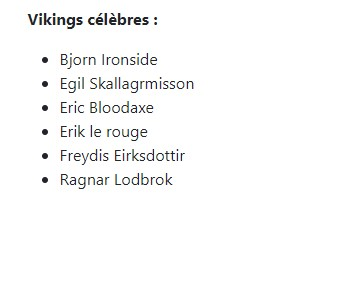

# Bootstrap et le texte

Dans ce chapitre, nous allons voir comment **Bootstrap** met en forme les éléments de base des pages : 
- titres
- texte
- abréviations
- citations
- listes
- ...
  
Nous verrons aussi quelques utilitaires qui permettent de centrer, montrer ou cacher des éléments, en plus de créer des remplissages ou des marges. Un peu de tout ce qui est nécessaire pour styliser le contenu de notre page HTML.

## Une page d’exemple

Voici une page qui regroupe les principaux éléments que nous allons voir au cours de ce chapitre avec une utilisation concrète de la grille :

```html

<div class="container">
    <header class="row">
        <div class="col">
            <h1 class="text-center text-uppercase m-4">
                Les Vikings<small class="text-muted"> et leurs exploits</small>
            </h1>
            <p>
                Les <strong>Vikings</strong> sont fascinants. Ils étaient de
                grands marins,
                commerçants, espions et bien sûr combattants! Ce site a été
                construit en
                <em>hommage à ces hommes et femmes qui ont façonné l'Europe
                    d'aujourd'hui.</em>
            </p>
            <p>
                Je suis membre de la <abbr
                    title="Société des explorateurs Vikings">SEV</abbr>
                qui a pour but de
                de recréer des expéditions Vikings avec les matériaux d'époque,
                ainsi que du
                <abbr title="Centre de Recherche sur les Vikings"
                      class="initialism">CRV</abbr>.
            </p>
            <p class="lead text-end">
                Ne vous arretez pas là si ça vous intéresse !
            </p>
            <p>
                Ceci : <span class="h1">ressemble à un titre</span>
                mais n'en est pas un.
            </p>
            <blockquote class="blockquote text-end">
                Plusieurs textes islandais, dont la saga des Groenlandais et
                celle d'Erik le Rouge, racontent la
                découverte par des Vikings de terres situées au-delà du
                Groenland.
                Vers 986, un navigateur groenlandais Bjarni Herjolfsson, dérouté
                par une tempête, aperçoit des
                terres et des forêts inconnues.
                Une vingtaine d'années plus tard, Leif, fils d'Erik le Rouge,
                entreprend une expédition pour
                vérifier le récit de Bjarni.
                Après plusieurs jours de navigation, il découvre de nouveaux
                territoires : un pays de montagnes et
                de glaciers qu'il nomme Helluland (« pays des pierres plates »),
                puis une côte dominée par un arrière-pays forestier, qu'il
                appelle Markland (« pays des arbres »),
                enfin, une terre agréable où les explorateurs pêchent des
                saumons et cueillent des grappes de
                raisin, le Vinland (« pays de la vigne »).
            </blockquote>
            <figcaption class="blockquote-footer">
                Texte recueilli dans <cite>Wikipedia</cite>
            </figcaption>
        </div>
    </header>
    <section>
        <div class="row">
            <div class="col">
                <h2 class="display-3 text-center bg-info py-4 mb-3 d-none d-md-block">
                    Quelques photos de Vikings
                </h2>
            </div>
        </div>
        <div class="row">
            <div class="col-6 col-sm-4 col-md-3 col-lg-2 mb-3">
                
            </div>
            <div class="col-6 col-sm-4 col-md-3 col-lg-2 mb-3">
                
            </div>
            <div class="col-6 col-sm-4 col-md-3 col-lg-2 mb-3">
                
            </div>
            <div class="col-6 col-sm-4 col-md-3 col-lg-2 mb-3">
                
            </div>
            <div class="col-6 col-sm-4 col-md-3 col-lg-2 mb-3">
                
            </div>
            <div class="col-6 col-sm-4 col-md-3 col-lg-2 mb-3">
                
            </div>
            <div class="col-6 col-sm-4 col-md-3 col-lg-2 mb-3">
                
            </div>
            <div class="col-6 col-sm-4 col-md-3 col-lg-2 mb-3">
                
            </div>
            <div class="col-6 col-sm-4 col-md-3 col-lg-2 mb-3">
                
            </div>
            <div class="col-6 col-sm-4 col-md-3 col-lg-2 mb-3">
                
            </div>
            <div class="col-6 col-sm-4 col-md-3 col-lg-2 mb-3">
                
            </div>
            <div class="col-6 col-sm-4 col-md-3 col-lg-2 mb-3">
                
            </div>
        </div>
        <div class="row">
            <div class="col-md-4">
                <p><strong>Vikings célèbres :</strong></p>
                <ul>
                    <li>Bjorn Ironside</li>
                    <li>Egil Skallagrmisson</li>
                    <li>Eric Bloodaxe</li>
                    <li>Erik le rouge</li>
                    <li>Freydis Eirksdottir</li>
                    <li>Ragnar Lodbrok</li>
                </ul>
            </div>
            <div class="col-md-8">
                
            </div>
        </div>
    </section>
    <section class="row">
        <div class="col">
            <h2 class="display-4 text-center text-danger p-md-3">Les grands
                peuples et royaumes Vikings</h2>
            <dl class="row">
                <dt class="col-md-3">Royaume de Norvège</dt>
                <dd class="col-md-9">La Norvège dès le début de l'âge des
                    Vikings est divisée en nombreux petits
                    royaumes, dirigés par des rois qui se battent pour de la
                    terre, la suprématie maritime ou
                    l'ascendant politique.
                </dd>
                <dt class="col-md-3">Royaume de Suède</dt>
                <dd class="col-md-9">Au 8ième siècle, c'est le début de l'âge
                    des Vikings, durant lequel les Suédois
                    (Varègues) sont principalement actifs vers l'Orient,
                    commerçant avec les peuples slaves de
                    Russie et poussant leurs expéditions jusqu'à Constantinople
                    et Bagdad.
                </dd>
                <dt class="col-md-3">Royaume d'Angleterre</dt>
                <dd class="col-md-9">Les Vikings sont présents dans les îles
                    Britanniques du 8ième au 10ième siècle.
                    Leurs activités dans cette région vont du commerce pacifique
                    aux campagnes de conquêtes
                    territoriales en passant par des incursions épisodiques.
                </dd>
                <dt class="col-md-3">Royaume de Normandie</dt>
                <dd class="col-md-9">En 911, un chef viking obtient du roi de
                    Francie Occidentale un territoire pour
                    lui et ses hommes, les « Hommes du Nord », qu’on appelle
                    aussi les « Normands ». Ainsi va naître
                    la Normandie.
                </dd>
                <dt class="col-md-3">Royaume de Sicile</dt>
                <dd class="col-md-9">Le royaume de Sicile, également appelé
                    royaume normand de Sicile, est un État
                    créé en 1130 par un Normand du nom de Roger II, incluant
                    l'île de Sicile, la Calabre, les
                    Pouilles et Naples.
                </dd>
            </dl>
        </div>
        <figure>
            <blockquote class="blockquote">
                Les Vikings ont toujours recherché de nouveaux territoires non
                pas pour la conquête, mais plutôt pour le commerce.
                Par contre, si un opportunité de piller se présentait... Gare à
                vous!
            </blockquote>
            <figcaption class="blockquote-footer">
                Texte recueilli dans <cite title="Source Title">La saga des
                aventures Vikings</cite>
            </figcaption>
        </figure>
        <p class="col text-justify">
            L'histoire des Vikings est vraiment intéressante. Il ne faut pas se
            limiter aux stéréotypes.
            De toute façon, il est fortement probable que vous aillez du sang
            Vikings dans vos veines.
            Pour tout renseignements veuillez me contacter à l'adresse
            ci-dessous.
        </p>
    </section>
    <hr>
    <footer class="row justify-content-center">
        <address>
            <strong>Chef du clan des massues pointues</strong><br>
            Avenue du fer et du feu<br>
            250 Ragnorik
        </address>
    </footer>
</div>
```

### Affichage sur très grand écran

Partie supérieure :


Partie inférieure :


### Affichage sur tablette

Sur tablette la principale adaptation a lieu au niveau des photos :


### Affichage sur smartphone en mode paysage et portrait

Pour ne pas alourdir ce chapitre je vous invite à voir l’aspect pour smartphones de votre côté.

## Les titres

### Titres classiques

Bootstrap met en forme les titres pour les balises de
`<h1>` à `<h6>` automatiquement

On a un titre `<h1>` dans la page d’exemple :


On remarque du texte délavé dans la fin du titre. C’est la classe `text-muted` qui a ici été utilisée :

```html
<h1 class="text-center text-uppercase m-4">
  Les Vikings
  <small class="text-muted"> et leurs exploits</small>
</h1>
```

Cette classe fait partie des classes **utilitaires** de Bootstrap. Il y a d’autres classes **utilitaires**, mais j’en parlerai plus loin dans un sous-chapitre dédié. De plus, la balise `<small>` permet d’écrire du texte en petit caractère (référence). Vous pouvez obtenir le même effet visuel avec les nouvelles classes `h1` à `h6`.

Quel est l’intérêt de ces classes puisqu’on a déjà les balises ?

Les balises `<h1>` à `<h6>` sont de type block. Imaginez que vous vouliez cet aspect pour un élément en ligne. Vous pouvez alors utiliser ces classes :

```html
<p>Ceci : <span class="h1">ressemble à un titre</span> mais n'en est pas un.</p>
```


### Classe « display »

La classe `display-*` crée des titres qui se démarquent du reste de la page :

```html
<h1 class="display-4">Classe display-4</h1>
<h1 class="display-3">Classe display-3</h1>
<h1 class="display-2">Classe display-2</h1>
<h1 class="display-1">Classe display-1</h1>
```

C’est ce qui est utilisé pour ce titre de la page d’exemple :


Avec ce code :

```html
<h2 class="display-4 text-center text-danger p-md-3">
  Les grands peuples et royaumes Vikings
</h2>
```

Je parlerai plus loin des autres classes utilisées. Notez que l’effet visuel serait le même quelle que soit la balise de titre utilisée. Ici j’ai utilisé `h2` pour la sémantique de la page.

### Classe lead

Une autre façon de mettre du texte en valeur sans que ce soit un titre est d’utiliser la classe lead. Cette classe est utilisée dans cette partie de la page d’exemple :


```html
<p class="lead text-end">
  Ne vous arretez pas là si ça vous intéresse !
</p>
```

Cette classe utilise ces règles :

```css
.lead {
  font-size: 1.25rem;
  font-weight: 300;
}
```

## Citations et abréviations
### Les citations

La page d’exemple utilise deux fois la balise `<blockquote>` pour des citations. Il y en a une en bas de la page avec ce code :

```html
<figure>
    <blockquote class="blockquote">
        Les Vikings ont toujours recherché de nouveaux territoires non pas pour la conquête, mais plutôt pour le commerce.
        Par contre, si un opportunité de piller se présentait... Gare à vous!
    </blockquote>
    <figcaption class="blockquote-footer">
        Texte recueilli dans <cite title="Source Title">La saga des aventures Vikings</cite>
    </figcaption>
</figure>
```

Avec ce rendu :


Il y a un `figcaption` pour insérer la référence de la citation, la mise en forme de cette référence fonctionne grâce à la présence de la classe `blockquote-footer`. La classe `blockquote` est utilisée pour le texte de la citation.


## Les abréviations

Prenons l'abréviation dans la page :

```html
<p>
    Je suis membre de la 
    <abbr title="Société des explorateurs Vikings">SEV</abbr> 
    qui a pour but de
    de recréer des expéditions Vikings avec les matériaux d'époque.
</p>
```

Voici le rendu :


## Listes classiques

Il y a une liste non ordonnée dans la page d’exemple :

```html
<ul>
    <li>Bjorn Ironside</li>
    <li>Egil Skallagrmisson</li>
    <li>Eric Bloodaxe</li>
    <li>Erik le rouge</li>
    <li>Freydis Eirksdottir</li>
    <li>Ragnar Lodbrok</li>
</ul>
```

Avec ce rendu :



Si vous ne voulez pas voir apparaître les puces utilisez la classe list-unstyled :

```html
<ul class="list-unstyled">
```

## Classes utilitaires

Bootstrap est muni de nombreuses classes **utilitaires** bien pratiques, que vous utiliserez fréquemment, et que nous allons voir à présent.

### Positionnement horizontal du texte

Il faut souvent placer du texte à droite, au centre, ou même parfois de le forcer à gauche. On veut aussi pouvoir le justifier. Voici les classes disponibles :

```html
<p class="text-start">Texte aligné à gauche</p>
<p class="text-center">Texte centré</p>
<p class="text-end">Texte aligné à droite</p>
<p class="text-justify">Texte justifié</p>
<p class="text-nowrap">Texte qui ne passe pas à la ligne même s'il n'a plus de place et qu'on voudrait le voir</p>
```

Voici le rendu :


On utilise le centrage dans la page d’exemple, par exemple pour ce titre :

```html
<h2 class="display-3 text-center bg-info py-4 mb-3 d-none d-md-block">Quelques photos de Vikings</h2>
```

On utilise la justification dans un paragraphe en bas de la page :

```html
<p class="col text-justify">
    L'histoire des Vikings est vraiment intéressante. Il ne faut pas se limiter aux stéréotypes.
    De toute façon, il est fortement probable que vous aillez du sang Vikings dans vos veines.
    Pour tout renseignements veuillez me contacter à l'adresse ci-dessous.
</p>
```

Les 3 premières classes existent en version « responsive » : `text-sm-start`, `text-sm-center`, `text-sm-end`.

## Transformations du texte
Regardez cette ligne de code de la page d’exemple :

```html
<h1 class="text-center text-uppercase m-4">
  Les Vikings
  <small class="text-muted"> et leurs exploits</small>
</h1>
```

La classe `text-uppercase` met tous les caractères en majuscules :


Il existe ces deux autres classes :

- `text-lowercase` pour tout mettre en minuscules,
- `text-capitalize` pour mettre uniquement le premier caractère en majuscule.
  
## On joue avec les couleurs

Regardez ce code dans la page d’exemple :

```html
<h2 class="display-4 text-center text-danger p-md-3">
  Les grands peuples et royaumes Vikings
</h2>
```

La classe `text-danger` met en rouge le texte du titre :


Il y a ainsi 7 classes pour colorer le texte :

```html
<div class="container bg-dark">
  <p class="text-muted">Texte délavé</p>
  <p class="text-primary">Texte primaire</p>
  <p class="text-secondary">Texte secondaire</p>
  <p class="text-success">Texte vert</p>
  <p class="text-info">Texte cyan</p>
  <p class="text-warning">Texte orange</p>
  <p class="text-danger">Texte rouge</p>
  <p class="text-white">Texte blanc</p>
  <p class="text-dark bg-white">Texte noir</p>
</div>
```

Le texte délavé a été utilisé pour une partie du titre de la page d’exemple. On peut aussi colorer le fond plutôt que le texte, c’est ce qui a été fait pour ce titre sur la page d’exemple :

```html
<h2 class="display-3 text-center bg-info py-4 mb-3 d-none d-md-block">
  Quelques photos de Vikings
</h2>
```

Voici toutes les possibilités :

```html
<p class="bg-primary text-white">Fond bleu</p>
<p class="bg-success text-white">Fond vert</p>
<p class="bg-info text-white">Fond cyan</p>
<p class="bg-warning text-white">Fond orange</p>
<p class="bg-danger text-white">Fond rouge</p>
<p class="bg-dark text-white">Fond noir</p>
<p class="bg-light">Fond délavé</p>
<p class="bg-white">Fond blanc</p>
```


## Marges et remplissage

On peut créer une combinaison de classes pour les marges et le remplissage (padding). Regardez par exemple cette partie du code de la page d’exemple :

```html
<h2 class="display-4 text-center text-danger p-md-3">
  Les grands peuples et royaumes Vikings
</h2>
```

Vous y trouvez la classe `p-md-3` qui peut se lire ainsi :

- `p` : padding
- `md` : medium
- `3` : valeur 3 (ça va de 0 à 5)

Autrement dit un remplissage de valeur moyenne. En voici une illustration :


Dans ce cas on obtiendrait le même résultat avec une marge, donc la classe `m-md-3`. Vous avez compris le principe. Plutôt que de vous donner la liste complète des classes, que vous pouvez trouver sur le site, je préfère vous expliquer la logique des appellations.

La classe est composée de trois éléments, dont le troisième est optionnel, séparés par des traits d’union:

`{propriété}{côtés optionnels}-{support optionnel}-{dimension}`

La propriété définit le type :
- `m` : marge
- `p` : remplissage (padding)

Les côtés définissent la position :
- `t` : haut (top)
- `e` : droite (end)
- `b` : bas (bottom)
- `s` : gauche (start)
- `x` : gauche et droite
- `y` : haut et bas

Le dernier élément définit la valeur :
- 0 : aucune valeur (0 rem)
- 1 : un quart de la valeur par défaut (0.25 rem)
- 2 : un demi de la valeur par défaut (0.5 rem)
- 3 : la valeur par défaut (1 rem)
- 4 : trois demi de la valeur par défaut (1.5 rem)
- 5 : valeur maximale (3 rem)

Par exemple on a ce code dans la page d’exemple :

```html
<h2 class="display-3 text-center bg-info py-4 mb-3 d-none d-md-block">
  Quelques photos de Vikings
</h2>
```

La classe `mb-3` crée des marges en bas de valeur moyenne pour tous les supports et la classe `py-4` du padding pour le haut et le bas :


Ces classes permettent d’éviter de créer des règles spécifiques pour peaufiner les mises en page.

--------------------------------------------------
Note du cours Développement Web 1 de l'automne 2022
