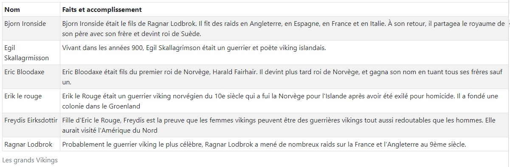
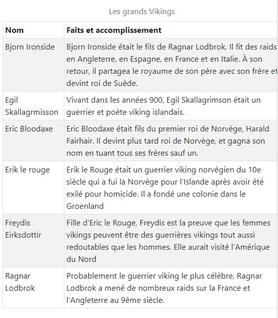
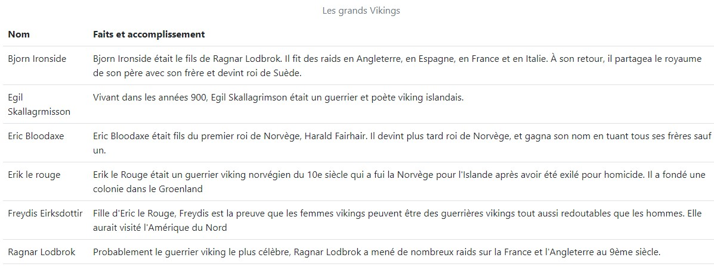
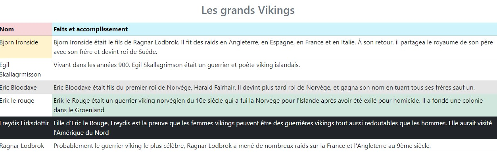
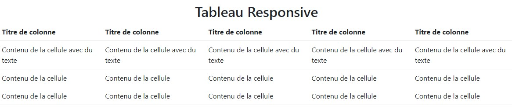
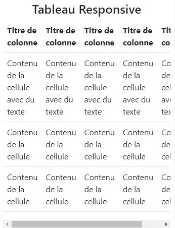

# Bootstrap et les tableaux

Dans ce chapitre nous allons voir comment Bootstrap traite les tableaux.

## La page d’exemple

Prenons la liste des Vikings du dernier chapitre et transformons-le en tableau.

```html
<table class="table table-bordered table-striped table-sm">
  <caption>
    Les grands Vikings
  </caption>
  <thead>
    <tr>
      <th>Nom</th>
      <th>Faits et accomplissement</th>
    </tr>
  </thead>
  <tbody>
    <tr>
      <td>Bjorn Ironside</td>
      <td>
        Bjorn Ironside était le fils de Ragnar Lodbrok.
        Il fit des raids en Angleterre, en Espagne, en France et
        en Italie. À son retour, il partagea le royaume de son père
        avec son frère et devint roi de Suède.
      </td>
    </tr>
    <tr>
      <td>Egil Skallagrmisson</td>
      <td>
        Vivant dans les années 900, 
        Egil Skallagrimson était un guerrier et poète viking islandais.
      </td>
    </tr>
    <tr>
      <td>Eric Bloodaxe</td>
      <td>
        Eric Bloodaxe était fils du premier roi de Norvège,
        Harald Fairhair. Il devint plus tard roi de Norvège,
        et gagna son nom en tuant tous ses frères sauf un.
      </td>
    </tr>
    <tr>
      <td>Erik le rouge</td>
      <td>
        Erik le Rouge était un guerrier  viking norvégien du 10e siècle
        qui a fui la Norvège pour l'Islande 
        après avoir été exilé pour homicide. 
        Il a fondé une colonie dans le Groenland
      </td>
    </tr>
    <tr>
      <td>Freydis Eirksdottir</td>
      <td>
        Fille d'Eric le Rouge, Freydis est la preuve 
        que les femmes vikings peuvent être des guerrières vikings
        tout aussi redoutables que les hommes.
        Elle aurait visité l'Amérique du Nord
      </td>
    </tr>
    <tr>
      <td>Ragnar Lodbrok</td>
      <td>
        Probablement le guerrier viking le plus célèbre, 
        Ragnar Lodbrok a mené de nombreux raids sur la France et
        l'Angleterre au 9ème siècle.
      </td>
    </tr>
  </tbody>
</table>
```

Avec cet aspect sur grand écran :



Remarquez que par défaut Bootstrap place le titre en bas à gauche. Cet emplacement peut paraître étrange. Si on regarde les règles on trouve :

```css
caption {
  padding-top: 0.75rem;
  padding-bottom: 0.75rem;
  color: #868e96;
  text-align: left;
  caption-side: bottom;
}
```

Pour avoir un titre en haut et centré il suffit de surcharger les deux dernières règles. 

```css
caption {
  text-align: center;
  caption-side: top;
}
```

Le tableau s’adapte automatiquement à la réduction de l'écran. Voici un exemple en version mobile :



## Les classes de base
### La classe table

Bootstrap ne formate pas par défaut la balise `<table>` pour ne pas entrer en conflit avec les nombreux composants qui utilisent des tableaux (par exemple les calendriers). Si on veut un style, il faut impérativement utiliser la classe `table`. Voyons ce que ça donne avec notre tableau :

```html
<table class="table">
```

On se retrouve avec cet aspect :



La mise en forme est légère et élégante avec des lignes séparatrices horizontales

### La classe table-striped

Cette classe ajoute un fond avec un gris très léger pour les lignes impaires (1, 3, …) pour tout ce qui se situe dans le `<tbody>` :

```html
<table class="table table-striped">
```

### La classe `table-sm`

Cette classe permet de condenser le tableau pour qu’il occupe moins de place verticalement :

```html
<table class="table table-striped table-sm">
```

On a maintenant les séparations verticales et on se retrouve avec le tableau tel qu’il est dans la page d’exemple.

### Survol

Il arrive de vouloir mettre en évidence une ligne d’un tableau au survol de la souris. Dans ce cas il faut utiliser la classe table-hover :

```html
<table class="table table-sm table-hover">
```

### Effet d’inversion et couleurs

Pour obtenir plus de contraste on peut assombrir le fond du tableau avec la classe `table-dark` :

```html
<table class="table table-sm table-dark">
```

Si vous désirez uniquement les titres sur fond noir il faut utiliser la classe `thead-dark` :

```html
<thead class="thead-dark">
```

### Fond gris pour les titres

Si vous désirez uniquement les titres sur fond gris il faut utiliser la classe `thead-light` :

```html
<thead class="thead-light">
```

### D'autres couleurs

Vous avez la possibilité de colorer le fond des lignes des tableaux avec ces classes :

- `table-primary` : couleur primaire
- `table-secondary` : couleur secondaire
- `table-light` : fond clair
- `table-dark` : fond sombre
- `table-info` : fond cyan
- `table-success` : fond vert
- `table-danger` : fond rouge
- `table-warning` : fond orange
- `table-active` : fond gris

Voici le tableau de notre exemple, mais avec un peu de couleur :



```html
<table class="table table-sm table-hover">
  <caption>
    <h3>Les grands Vikings</h3>
  </caption>
  <thead class="table-info">
    <tr>
      <th class="table-danger">Nom</th>
      <th>Faits et accomplissement</th>
    </tr>
  </thead>
  <tbody>
    <tr>
      <td class="table-warning">Bjorn Ironside</td>
      <td>
        Bjorn Ironside était le fils de Ragnar Lodbrok.
        Il fit des raids en Angleterre, en Espagne, en France et
        en Italie. À son retour, il partagea le royaume de son père
        avec son frère et devint roi de Suède.
      </td>
    </tr>
    <tr>
      <td>Egil Skallagrmisson</td>
      <td>
        Vivant dans les années 900, 
        Egil Skallagrimson était un guerrier et poète viking islandais.
      </td>
    </tr>
    <tr class="table-active">
      <td>Eric Bloodaxe</td>
      <td>
        Eric Bloodaxe était fils du premier roi de Norvège,
        Harald Fairhair. Il devint plus tard roi de Norvège,
        et gagna son nom en tuant tous ses frères sauf un.
      </td>
    </tr>
    <tr>
      <td>Erik le rouge</td>
      <td class="table-success">
        Erik le Rouge était un guerrier  viking norvégien du 10e siècle
        qui a fui la Norvège pour l'Islande 
        après avoir été exilé pour homicide. 
        Il a fondé une colonie dans le Groenland
      </td>
    </tr>
    <tr class="table-dark">
      <td>Freydis Eirksdottir</td>
      <td>
        Fille d'Eric le Rouge, Freydis est la preuve 
        que les femmes vikings peuvent être des guerrières vikings
        tout aussi redoutables que les hommes.
        Elle aurait visité l'Amérique du Nord
      </td>
    </tr>
    <tr>
      <td>Ragnar Lodbrok</td>
      <td>
        Probablement le guerrier viking le plus célèbre, 
        Ragnar Lodbrok a mené de nombreux raids sur la France et
        l'Angleterre au 9ème siècle.
      </td>
    </tr>
  </tbody>
</table>
```

J’ai fait un peu n’importe quoi pour montrer qu’on peut indifféremment styliser une ligne ou une cellule. Mais évidemment, cette possibilité de colorisation prend tout son sens dans une gestion dynamique de données, pour faire ressortir certaines données possédant certaines caractéristiques.

## Tableau « responsive »

Que se passe-t-il pour un tableau quand on réduit la largeur de l’affichage ? Les colonnes du tableau se réduisent en conséquence jusqu’à rendre l’apparence ni très esthétique, ni très lisible s’il y a de nombreuses colonnes. Considérez le tableau suivant :

```html
<table class="table">
  <thead>
    <tr>
      <th>Titre de colonne</th>
      <th>Titre de colonne</th>
      <th>Titre de colonne</th>
      <th>Titre de colonne</th>
      <th>Titre de colonne</th>
    </tr>
  </thead>
  <tbody>
    <tr>
      <td>Contenu de la cellule</td>
      <td>Contenu de la cellule</td>
      <td>Contenu de la cellule</td>
      <td>Contenu de la cellule</td>
      <td>Contenu de la cellule</td>
    </tr>
    <tr>
      <td>Contenu de la cellule</td>
      <td>Contenu de la cellule</td>
      <td>Contenu de la cellule</td>
      <td>Contenu de la cellule</td>
      <td>Contenu de la cellule</td>
    </tr>
    <tr>
      <td>Contenu de la cellule</td>
      <td>Contenu de la cellule</td>
      <td>Contenu de la cellule</td>
      <td>Contenu de la cellule</td>
      <td>Contenu de la cellule</td>
    </tr>
  </tbody>
</table>
```

Sur grand écran pas de souci :



Mais quand on réduit la place manque vite jusqu’à carrément tronquer le tableau.

En englobant le tableau avec la classe ‌table-responsive, on fait apparaître une barre de défilement :

```html
<div class="table-responsive">
   <table class="table ...">
       ...
    </table>
</div>
```



--------------------------------------------------
Note du cours Développement Web 1 de l'automne 2022
