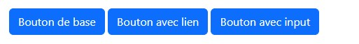
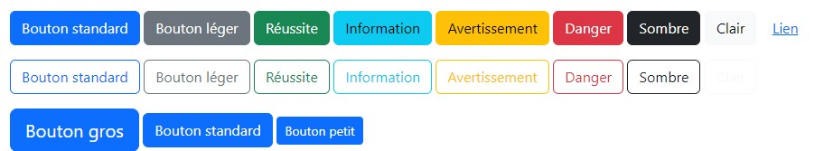
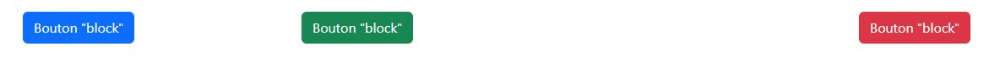
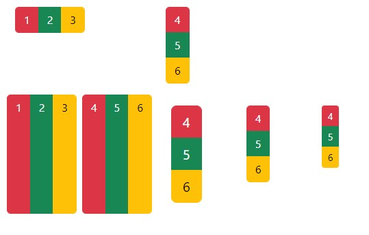
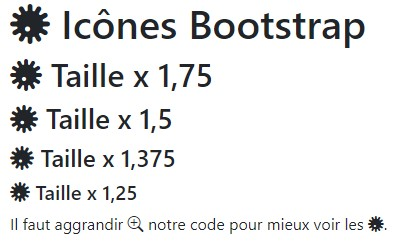
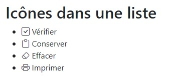
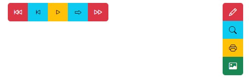
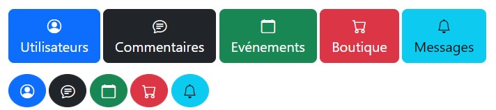
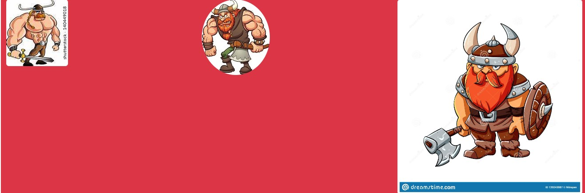
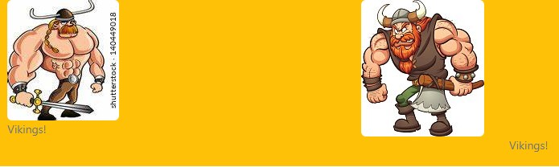

# Bootstrap icône et bouton

Dans cet article, nous allons voir comment créer des boutons plus stylisés, utiliser des icônes pour animer nos pages et insérer des images en les rendant autant que possible « responsives ».

## Les boutons

Pour créer un bouton avec **Bootstrap**, il suffit d’ajouter la classe `btn` et une classe pour la couleur comme `btn-primary` à une balise `<button>`, `<a>` ou `<input>` :

```html
<button type="button" class="btn btn-primary">Bouton de base</button>
<a class="btn btn-primary" href="#" role="button">Bouton avec lien</a>
<input class="btn btn-primary" type="button" value="Bouton avec input">
```


Le rendu est normalement le même (ça dépend du navigateur utilisé), tout dépend du contexte d’utilisation.

Les différents types de boutons

Il existe 9 possibilités avec les classes `btn-*` :

```html
<button type="button" class="btn btn-primary">Bouton standard</button>
<button type="button" class="btn btn-secondary">Bouton léger</button>
<button type="button" class="btn btn-success">Réussite</button>
<button type="button" class="btn btn-info">Information</button>
<button type="button" class="btn btn-warning">Avertissement</button>
<button type="button" class="btn btn-danger">Danger</button>
<button type="button" class="btn btn-dark">Sombre</button>
<button type="button" class="btn btn-light">Clair</button>
<button type="button" class="btn btn-link">Lien</button>
```

## Les boutons sans fond

Il est aussi possible de ne pas avoir le fond coloré avec les classes `btn-*-outline` :

```html
<button type="button" class="btn btn-outline-primary">
  Bouton standard
</button>
<button type="button" class="btn btn-outline-secondary">
  Bouton léger
</button>
<button type="button" class="btn btn-outline-success">
  Réussite
</button>
<button type="button" class="btn btn-outline-info">
  Information
</button>
<button type="button" class="btn btn-outline-warning">
  Avertissement
</button>
<button type="button" class="btn btn-outline-danger">
  Danger
</button>
<button type="button" class="btn btn-outline-dark">
  Sombre
</button>
<button type="button" class="btn btn-outline-light">
  Clair
</button>
```

Le **light** est si clair qu’on ne le voit pas sur un fond blanc.

## Dimension des boutons

On peut aussi ajuster la dimension du bouton avec les classes `btn-lg` et `btn-sm` :

```html
<button type="button" class="btn btn-primary btn-lg">
  Bouton gros
</button>
<button type="button" class="btn btn-primary">
  Bouton standard
</button>
<button type="button" class="btn btn-primary btn-sm">
  Bouton petit
</button>
```



### Boutons « block »

La grille **Bootstrap ** est parfait pour placer des boutons sur une même ligne avec un espacement :

```html
<div class="row">
  <div class="col-sm-3">
    <button type="button" class="btn btn-primary">
      Bouton "block"
    </button>
  </div>
  <div class="col-sm-6">
    <button type="button" class="btn btn-success">
      Bouton "block"
    </button>
  </div>
  <div class="col-sm-3">
    <button type="button" class="btn btn-danger">
      Bouton "block"
    </button>
  </div>
</div>
```



### Grouper des boutons

Il est possible de grouper des boutons horizontalement avec la classe btn-group. Ce groupement peut s’effectuer aussi verticalement avec la classe btn-group-vertical :

```html
<div class="row">
  <div class="col-lg-2">
    <div class="btn-group">
        <a class="btn btn-danger" href="#">1</a>
        <a class="btn btn-success" href="#">2</a>
        <a class="btn btn-warning" href="#">3</a>
    </div>
  </div>
  <div class="col-lg-1">
    <div class="btn-group-vertical">
        <a class="btn btn-danger" href="#">4</a>
        <a class="btn btn-success" href="#">5</a>
        <a class="btn btn-warning" href="#">6</a>
    </div>
  </div>
</div>
```

Il est possible de créer des organisations plus complexes avec la classe btn-toolbar :

```html
<div class="btn-toolbar">
  <div class="btn-group mr-2">
      <a class="btn btn-danger" href="#">1</a>
      <a class="btn btn-success" href="#">2</a>
      <a class="btn btn-warning" href="#">3</a>
  </div>
  <div class="btn-group">
      <a class="btn btn-danger" href="#">4</a>
      <a class="btn btn-success" href="#">5</a>
      <a class="btn btn-warning" href="#">6</a>
  </div>
```

On peut dimensionner un groupement avec les classes `btn-group-lg` et `btn-group-sm` :

```html
<div class="row">
  <div class="col-lg-1">
    <div class="btn-group-vertical btn-group-lg">
        <a class="btn btn-danger" href="#">4</a>
        <a class="btn btn-success" href="#">5</a>
        <a class="btn btn-warning" href="#">6</a>
    </div>
  </div>
  <div class="col-lg-1">
    <div class="btn-group-vertical">
        <a class="btn btn-danger" href="#">4</a>
        <a class="btn btn-success" href="#">5</a>
        <a class="btn btn-warning" href="#">6</a>
    </div>
  </div>
  <div class="col-lg-1">
    <div class="btn-group-vertical btn-group-sm">
        <a class="btn btn-danger" href="#">4</a>
        <a class="btn btn-success" href="#">5</a>
        <a class="btn btn-warning" href="#">6</a>
    </div>
  </div>
</div>
```



## Des icônes

La tendance est d’utiliser les icônes de Font Awesome. Bien que désormais aucune librairie d’icônes ne soit prévue par défaut pour Bootstrap, je vais montrer comment en utiliser parce que c’est quelque chose de très utile et fréquent.

J'ai choisi la bibliothèque **Bootstrap icons** -­ https://icons.getbootstrap.com/ fourni par la même orgarnisation que **Bootstrap**. La bibliothèque est libre de droit.

### La librairie Bootstrap icons

**Bootstrap icons** propose une collection de 1600 icônes disponibles et d'intégrant avec Bootstrap facilement.

Évidemment, comme elles ne sont pas intégrées de base il faut déclarer le fichier CSS pour pouvoir les utiliser. Le site propose plusieurs possibilités pour le faire, la plus simple étant d’utiliser un CDN :

```html
<link rel="stylesheet" 
      href="https://cdn.jsdelivr.net/npm/bootstrap-icons@1.9.1/font/bootstrap-icons.css">
```

Une fois le fichier CSS déclaré, vous pouvez utiliser les icônes. L’icône doit être intégrée avec une balise `<i>` avec des classes css. Exemple -­ https://icons.getbootstrap.com/icons/virus/ 

Il faut aggrandir `<i class="bi bi-zoom-in"></i>` notre code pour mieux voir les `<i class="bi bi-virus"></i>`

Comme les icônes sont des SVG, les images peuvent être redimensionnées sans problème de résolution.
Par défaut, les icônes suivent le `font-size` pour déterminer leur taille.

On peut le remarquer facilement en utilisant différents entêtes : 

```html
<h1><span class="bi bi-virus"></span> Taille normale</h1>
<h2><span class="bi bi-virus"></span> Taille double</h2>
<h3><span class="bi bi-virus"></span> Taille triple</h3>
<h4><span class="bi bi-virus"></span> Taille quadruple</h4>
<h5><span class="bi bi-virus"></span> Taille quintuple</h5>
```



On peut aussi très facilement créer une liste dont les éléments sont bien identifiés avec une icône :

```html
<ul>
  <li><i class="bi bi-check-square"></i> Vérifier</li>
  <li><i class="bi bi-clipboard"></i> Conserver</li>
  <li><i class="bi bi-eraser"></i> Effacer</li>
  <li><i class="bi bi-printer"></i> Imprimer</li>
</ul>
```



On peut bien sûr faire plusieurs agencements d'icônes ou les animer. Je vous donne une inspiration ici, mais n'hésitez pas à explorer pour des idées.

Par exemple pour changer la couleur, on peut utiliser la propriété `color`.

```css
.anime-virus:hover{
  color: lime;
  animation: flash 2s infinite;
}

@keyframes flash {
  25% {
     color: lime;
  }
  50% {
     color: green;
  }
  75% {
     color: lime;
  }
  100% {
     color: green;
  }
}
```

```html
<span class="bi bi-virus anime-virus"></span>
```

### Des icônes pour les boutons

Il est facile d’ajouter une icône à un bouton. C’est ce que j’ai prévu pour le bouton de soumission de la page d’exemple :

```html
<button type="submit" class="btn btn-info">
  <span class="bi bi-search"></span> Chercher
</button>
```

On peut ainsi créer d’élégantes barres de boutons :

```html
<div class="container">
  <div class="row" >
    <div class="col-md-4">
      <div class="btn-group">
        <a class="btn btn-danger" href="#">
          <span class="bi bi-skip-backward"></span>
        </a>
        <a class="btn btn-info" href="#">
          <span class="bi bi-skip-start"></span>
        </a>
        <a class="btn btn-warning" href="#">
          <span class="bi bi-play"></span>
        </a>
        <a class="btn btn-info" href="#">
          <span class="bi bi-forward"></span>
        </a>
        <a class="btn btn-danger" href="#">
          <span class="bi bi-fast-forward"></span>
        </a>
      </div>
    </div>
    <div class="col-md-1">
      <div class="btn-group-vertical">
        <a class="btn btn-danger" href="#">
          <span class="bi bi-pencil"></span>
        </a>
        <a class="btn btn-info" href="#">
          <span class="bi bi-search"></span>
        </a>
        <a class="btn btn-warning" href="#">
          <span class="bi bi-printer"></span>
        </a>
        <a class="btn btn-success" href="#">
          <span class="bi bi-image"></span>
        </a>
      </div>
    </div>
  </div>
</div>
```




On peut mettre ces icônes ailleurs que sur des boutons… Partout où on peut écrire en fait !

Rien n’empêche évidemment de sauter des lignes. On peut ainsi créer des boutons en séparant bien l’icône du texte :

```html
<button class="btn btn-primary btn-lg">
  <span class="bi bi-person-circle"></span><br>Utilisateurs
</button>
<button class="btn btn-dark btn-lg">
  <span class="bi bi-chat-text"></span><br>Commentaires
</button>
<button class="btn btn-success btn-lg">
  <span class="bi bi-calendar"></span><br>Evénements
</button>
<button class="btn btn-danger btn-lg">
  <span class="bi bi-cart"></span><br>Boutique
</button>
<button class="btn btn-info btn-lg">
  <span class="bi bi-bell"></span><br>Messages
</button>
```

Et pour faire des boutons ronds ?

Il est facile, en ajoutant la classe **Bootstrap** `rounded-circle`.

En voici un exemple :

```html
<button class="btn btn-primary btn-lg rounded-circle">
  <span class="bi bi-person-circle"></span>
</button>
<button class="btn btn-dark btn-lg rounded-circle">
  <span class="bi bi-chat-text"></span>
</button>
<button class="btn btn-success btn-lg rounded-circle">
  <span class="bi bi-calendar"></span>
</button>
<button class="btn btn-danger btn-lg rounded-circle">
  <span class="bi bi-cart"></span>
</button>
<button class="btn btn-info btn-lg rounded-circle">
  <span class="bi bi-bell"></span>
</button>
```



## Les images et les figures

Il existe la classe `img-fluid` pour rendre les images adaptées à leur contenant avec ces règles :

```css
.img-fluid {
  max-width: 100%;
  height: auto;
}
```

C’est ce que j’ai utilisé pour les images de la page d’exemple :

```html

<div class="col-6 col-sm-4 col-md-3 col-lg-2 mb-3">
    
</div>
```

D’autre part Bootstrap donne la possibilité de modifier l’apparence des bordures, ce qui peut être appliqué aux images. Il y a pour cela 8 classes utilisables :

- `rounded`
- `rounded-top`
- `rounded-end`
- `rounded-bottom`
- `rounded-start`
- `rounded-circle`
- `rounded-pill`
- `rounded-*` (de 0 à 5)

Les nom sont explicites !

D’autre part spécifiquement pour les images existe la classe `img-thumbnail` qui ajoute une bordure arrondie de `1px`.

Voici un exemple illustratif de 3 de ces effets :

```html

<div class="container">
    <div class="row bg-danger">
        <div class="col-4">
            
        </div>
        <div class="col-4">
            
        </div>
        <div class="col-4">
            
        </div>
    </div>
</div>
```



## Les figures

Pour associer un titre à une image (ou autre) la balise figure bénéficie de quelques classes. Voici un exemple :

```html

<figure class="col-4 figure">
    
    <figcaption class="figure-caption">Vikings!</figcaption>
</figure>
<figure class="col-4 figure">
    
    <figcaption class="figure-caption text-center">Vikings!</figcaption>
</figure>
```

On utilise globalement la balise `<figure>` avec la classe figure. Et pour le titre la balise `<figcaption>` et la classe `figure-caption`.



Le titre peut être positionné en utilisant les classes que nous avons déjà vues pour le texte.
