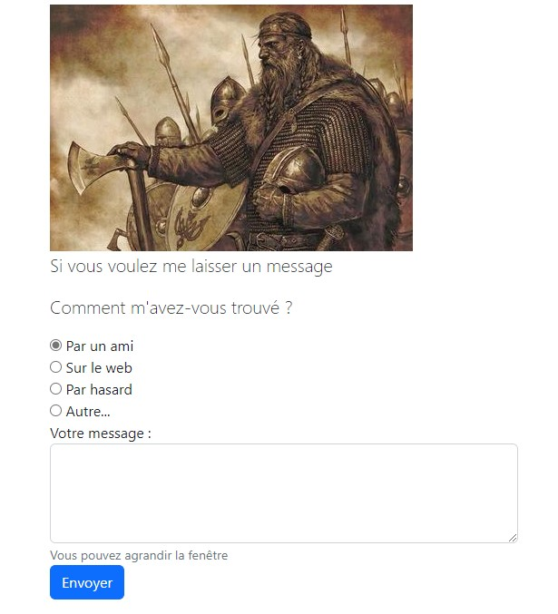

# Bootstrap et les formulaires

Les formulaires sont très souvent utilisés sur les pages web, voyons dans ce chapitre ce que Bootstrap nous propose comme mise en forme.

## Les contrôles

Bootstrap utilise à la base les contrôles HTML :

- `input`
- `textarea`
- `button`
- `select`
- `label`
- `form`

## La page d’exemple

Voici un formulaire de contact simple :

```html
<section class="row justify-content-center">
  <div class="col-md-8">
    <p class="lead font-weight-bold">
      Si vous voulez me laisser un message
      </p>
    <form>            
      <p class="lead">
        Comment m'avez-vous trouvé ?
        </p>
      <div class="form-check">
        <label class="form-check-label">
          <input class="form-check-input" 
                 type="radio" 
                 name="origine" 
                 value="ami" 
                 checked>
          Par un ami 
        </label>
      </div>
      <div class="form-check">
        <label class="form-check-label">
          <input class="form-check-input" 
                 type="radio" 
                 name="origine" 
                 value="web">
          Sur le web 
        </label>
      </div>
      <div class="form-check">
        <label class="form-check-label">
          <input class="form-check-input" 
                 type="radio" 
                 name="origine" 
                 value="hasard">
          Par hasard 
        </label>
      </div>
      <div class="form-check">
        <label class="form-check-label">
          <input class="form-check-input" 
                 type="radio" 
                 name="origine" 
                 value="autre">
          Autre... 
        </label>
      </div>
      <div>
        <label for="textarea">Votre message :</label>
        <textarea id="textarea" 
                  class="form-control" 
                  rows="4"></textarea>
        <small class="form-text text-muted">
          Vous pouvez agrandir la fenêtre
        </small>
      </div>
      <button class="btn" type="submit">
        Envoyer
      </button>
    </form>
    <br>
  </div>
</section>
```

Avec la grille, pour les tablettes et écrans plus grands, on a un formulaire centré :


Sur smartphone le formulaire occupe toute la largeur disponible. C'est important de donner beaucoup d'espaces en mobile pour les formulaires, car les utilisateurs doivent utiliser leurs doigts.



## Formulaire de base

Si on n’utilise aucune classe particulière dans une balise `<select>`, `<input>` ou `<textarea>`, on obtient une disposition en ligne. Prenons l’exemple d’un formulaire simple :

```html
<form>        
  Text : <input type="text">
  Textarea : 
  <textarea>Un peu de texte ici</textarea>
  Select :
  <select>
    <option>Option 1</option>
    <option>Option 2</option>
    <option>Option 3</option>
  </select>
  <button>Envoyer</button>
</form>
```

Nous aurons alors ce rendu :


Par défaut les contrôles s’alignent horizontalement. J’aimerais que les contrôles occupent toute la largeur disponible et soient plus jolis. Il faut utiliser la classe `form-control` pour obtenir cet effet :

```html
<form>
  <label for="texte">Text : </label>
  <input id="text" type="text" class="form-control">
  <label for="textarea">Textarea : </label>
  <textarea id="textarea" class="form-control">Un peu de texte ici</textarea>
  <label for="select">Select : </label>
  <select id="select" class="form-control">
    <option>Option 1</option>
    <option>Option 2</option>
    <option>Option 3</option>
  </select>
  <button>Envoyer</button>
</form>
```

Arrangeons encore ce formulaire en utilisant des balises `<label>` avec `form-label` :‌

```html
<form>
  <div>
    <label for="texte" class="form-label">Text : </label>
    <input id="texte" type="text" class="form-control">
  </div>
  <div>
    <label for="textarea" class="form-label">Textarea : </label>
    <textarea id="textarea" class="form-control">Un peu de texte ici</textarea>
  </div>
  <div class="my-2">
    <label for="select" class="form-label">Select : </label>
    <select id="select" class="form-control">
      <option>Option 1</option>
      <option>Option 2</option>
      <option>Option 3</option>
    </select>
  </div>
  <button>Envoyer</button>
</form>
```


Le formulaire est maintenant bien aéré avec ajout de marges et présente l’aspect standard d’un formulaire avec Bootstrap.

### Boutons « radio » et cases à cocher

Bootstrap propose pour les boutons « radio » et les cases à cocher des classes spécifiques :

- `form-check`
- `form-check-label`
- `form-check-input`

Je les ai utilisées dans le formulaire de la page :

```html
<div class="form-check">
  <label class="form-check-label">
    <input class="form-check-input" type="radio" name="origine" value="ami" checked>
    Par un ami 
  </label>
</div>
<div class="form-check">
  <label class="form-check-label">
    <input class="form-check-input" type="radio" name="origine" value="web">
    Sur le web 
  </label>
</div>
<div class="form-check">
  <label class="form-check-label">
    <input class="form-check-input" type="radio" name="origine" value="hasard">
    Par hasard 
  </label>
</div>
<div class="form-check">
  <label class="form-check-label">
    <input class="form-check-input" type="radio" name="origine" value="autre">
    Autre... 
  </label>
</div>
```

Avec un rendu plutôt esthétique :


Prévoyez toujours une balise `label` pour obtenir un affichage correct à moins que vous ne désiriez appliquer un style personnalisé.

On utilise la même syntaxe pour les cases à cocher (il suffit en fait de changer le type) :

```html
<div class="form-check">
  <label class="form-check-label">
    <input class="form-check-input" type="checkbox" name="origine" value="ami" checked>
    Par un ami 
  </label>
</div>
<div class="form-check">
  <label class="form-check-label">
    <input class="form-check-input" type="checkbox" name="origine" value="web">
    Sur le web 
  </label>
</div>
<div class="form-check">
  <label class="form-check-label">
    <input class="form-check-input" type="checkbox" name="origine" value="hasard">
    Par hasard 
  </label>
</div>
<div class="form-check">
  <label class="form-check-label">
    <input class="form-check-input" type="checkbox" name="origine" value="autre">
    Autre... 
  </label>
</div>
```

Par défaut les contrôles s’empilent. Si on les veut en ligne il faut utiliser la classe `form-check-inline` :

```html
<div class="form-check form-check-inline">
```

Pour avoir un bouton « radio » ou une case à cocher désactivé(e), il faut associer la classe `disabled` à la classe `form-check`.

## Utilisation de la grille et formulaire en ligne

Pour organiser visuellement un formulaire, on peut évidemment utiliser la grille. C'est la manière la plus efficace pour gérer le présentation d'un formulaire :

```html
<form class="col-md-6">
  <div class="row">
    <label for="text" class="col-md-3 col-form-label">Text :</label>
    <div class="col-md-9">
      <input type="text" class="form-control" id="text">
    </div>
  </div>
  <div class="row">
    <label for="textarea" class="col-md-3 col-form-label">Textarea :</label>
    <div class="col-md-9">
      <input type="textarea" class="form-control" id="textarea">
    </div>
  </div>
  <div class="row">
    <label for="select" class="col-md-3 form-control-label">Select :</label>
    <div class="col-md-9">
      <select id="select" class="form-control" >
        <option>Option 1</option>
        <option>Option 3</option>
        <option>Option 3</option>
      </select>
    </div>
  </div>
  <div class="row">
    <div class="col">
      <button type="submit" class="btn btn-primary">Envoyer</button>
    </div>
  </div>
</form>
```


Les étiquettes disposent de 3 colonnes et les champs de saisie de 9 colonnes. 

Il arrive qu’on ait besoin d’avoir un formulaire disposé sur une ligne, par exemple dans une barre de navigation. On doit mettre le tout dans une même ligne :

```html
<form class="row g-2">
  <label for="text" class="col-md-1 align-self-center">Texte</label>
  <input type="text" class="col-md-4" id="text3" placeholder="un texte ici">
  <div class="form-check col-md-2 ms-2">
    <label class="form-check-label">
      <input class="form-check-input" type="checkbox"> Se souvenir de moi...
    </label>
  </div>
  <button type="submit" class="btn btn-primary col-md-2">Envoyer</button>
</form>
```


Si vous réduisez la largeur de l’affichage au-dessous de 576 pixels alors les contrôles vont s’empiler :


Ce comportement est judicieux parce qu’il n’y aurait plus vraiment la place d’afficher un formulaire en ligne.

Les étiquettes prennent de la place dans un formulaire en ligne. Ne serait-il pas mieux de ne pas en mettre ?

C’est effectivement une bonne idée, mais il ne faut pas oublier l’accessibilité des formulaires. Il existe des lecteurs d’écran qui nécessitent la présence d’étiquettes, alors comment faire ? Bootstrap nous propose la classe sr-only pour résoudre ce problème facilement :

```html
<label for="text" class="sr-only">Texte</label>
```

L’étiquette ne sera active que pour les lecteurs d’écran.

## Les groupes de contrôles

Avec Bootstrap on peut facilement ajouter à un contrôle de formulaire du texte, un ou plusieurs boutons…

### Accoler une information à un contrôle

La classe `input-group` sert à accoler une information à un contrôle de formulaire. On définit un élément `input-group-text` pour le texte :

```html
<form class="row g-2">
  <div class="input-group col-md-4">
    <span class="input-group-text">€</span>
    <input type="text" class="form-control" value="100">
  </div>
  <div class="input-group col-md-4">
    <input type="text" class="form-control text-right" value="100,50">
    <span class="input-group-text">€</span>
  </div>
</form>
```

Il est possible d’ajuster la dimension globale du groupement avec les classes `input-group-*` :

```html
<form class="row g-2">
  <div class="input-group input-group-lg col-md-4">
    <span class="input-group-text">€</span>
    <input type="text" class="form-control" value="100">
  </div>
  <div class="input-group input-group-sm col-md-4">
    <input type="text" class="form-control text-right" value="100,50">
    <span class="input-group-text">€</span>
  </div>
</form>
```


Notez que si vous placez le `input-group-text` avant le `input`, le groupe sera placé avant le contrôle. L'inverse si vous placez le `input-group-text` après le `input`.

### Accoler un contrôle à un contrôle

Le seul cas intéressant de l’accolement de deux contrôles est celui de l’utilisation d’un bouton « radio » ou d’une case à cocher :

```html
<form>
  <div>
    <div class="input-group">
      <div class="input-group-text">
        <input type="checkbox">
      </div>
      <input type="text" class="form-control">
    </div>
  </div>
  <div>
    <div class="input-group">
      <div class="input-group-text">
        <input type="radio">
      </div>
      <input type="text" class="form-control">
    </div>
  </div>
</form>
```


On peut de la même manière accoler un bouton.

### Effets particuliers

Dans cette section, nous allons voir un certain nombre d’effets qui peuvent être utiles. Voici un code récapitulatif :

```html
<form>
  <div class="row">
    <label class="col-md-4 col-form-label text-right">Contrôle statique :</label>
    <div class="col-md-8">
      <p class="form-control-static">Ce contrôle est statique</p>
    </div>
  </div>
  <div class="row">
    <label class="col-md-4 col-form-label text-right" for="inactif">
      Contrôle désactivé :
    </label>
    <div class="col-md-8">
      <input type="text" 
             id="inactif" 
             class="form-control"
            placeholder="Ce contrôle n'est pas actif" 
            disabled>
    </div>
  </div>
  <div class="row">
    <label class="col-md-4 col-form-label text-right" for="inactif">
      Contrôle en lecture seule :
    </label>
    <div class="col-md-8">
      <input type="text" 
             id="inactif" 
             class="form-control" 
             placeholder="Ce contrôle est en lecture seule" 
             readonly>
    </div>
  </div>
  <div class="row">
    <label class="col-md-4 col-form-label form-control-lg text-right" 
          for="inactif">
      Contrôle géant :
    </label>
    <div class="col-md-8">
      <input type="text" 
             id="inactif" 
             class="form-control form-control-lg"
             placeholder="Ce contrôle est géant">
    </div>
  </div>
  <div class="row">
    <label class="col-md-4 col-form-label form-control-sm text-right" 
           for="inactif">
      Contrôle petit :
    </label>
    <div class="col-md-8">
      <input type="text" 
             id="inactif" 
             class="form-control form-control-sm" 
             placeholder="Ce contrôle est petit">
    </div>
  </div>
  <div class="row">
    <label class="col-md-4 col-form-label form-control-sm text-right" 
           for="inactif">
      Contrôle normal :
    </label>
    <div class="col-md-8">
      <input type="text" 
             id="inactif"
             class="form-control" 
             placeholder="Ce contrôle est normal">
      <small class="form-text text-muted">
        Un petit texte explicatif pour le contrôle
      </small>
    </div>
  </div>
</form>
```

Avec ce rendu :


Un contrôle statique (on a du texte à la place d’un contrôle de saisie) se crée avec la classe `‌form-control-static`.

- Un contrôle est désactivé avec l’attribut `disabled`.
- Un contrôle est en lecture seule avec l’attribut `readonly`.
- Un contrôle est dimensionné avec une classe `form-control-*`.
  
Pour ajouter un texte d’aide, la classe `text-muted` est parfaite associée à la classe `form-text`.

## La validation du navigateur

La validation côté client doit être considérée comme cosmétique parce qu’elle ne présente aucune sécurité. Mais elle permet d’éviter des va-et-vient avec le serveur en créant un premier filtre de saisie.

### Validation par défaut

Depuis HTML5 les navigateurs offrent certaines capacités de validation des entrées de formulaire côté client :

- avec l’attribut `required` pour rendre une saisie obligatoire,
- en utilisant une expression régulière avec l’attribut `pattern`,
- en imposant une plage de saisie avec les attributs `min`, `max`, `maxlength`…
- en imposant un type d’entrée avec l’attribut `type`…

Les possibilités sont vastes et intéressantes surtout que tout est automatique ! 

Voyons un exemple :

```html
<form>
  <div>
    <label for="nom">Nom</label>
    <input type="text" 
           class="form-control" 
           id="nom" 
           placeholder="Nom" 
           required>
  </div>
  <div>
    <label for="prenom">Prénom</label>
    <input type="text" 
           class="form-control" 
           id="prenom" 
           placeholder="Prénom" 
           required>
  </div>
  <div>
    <label for="prenom">Age</label>
    <input type="number" 
           class="form-control" 
           id="age" 
           value="20"
           min="20" 
           max="80" 
           required>
  </div>
  <button class="btn btn-primary" type="submit">Envoyer</button>
</form>
```

Dans ce formulaire on a 3 champs de saisie. Les deux premiers sont de type texte et le troisième de type numérique avec une plage de valeurs. D’autre part les 3 sont à saisie obligatoire avec l’attribut `required`.

Voici le formulaire :


On voit que le troisième champ s’est adapté avec des petits boutons pour faire défiler les valeurs.

Si on ne renseigne pas un champ le navigateur nous en informe à la soumission.
De même si le type de donnée n’est pas correct ou si on sort de la plage de valeurs.

On ne peut pas changer l’apparence de ces messages, juste le texte, mais pour cela il faut un peu de Javascript. Comme ce n’est pas le sujet de ce cours, je ne développe pas cet aspect.
